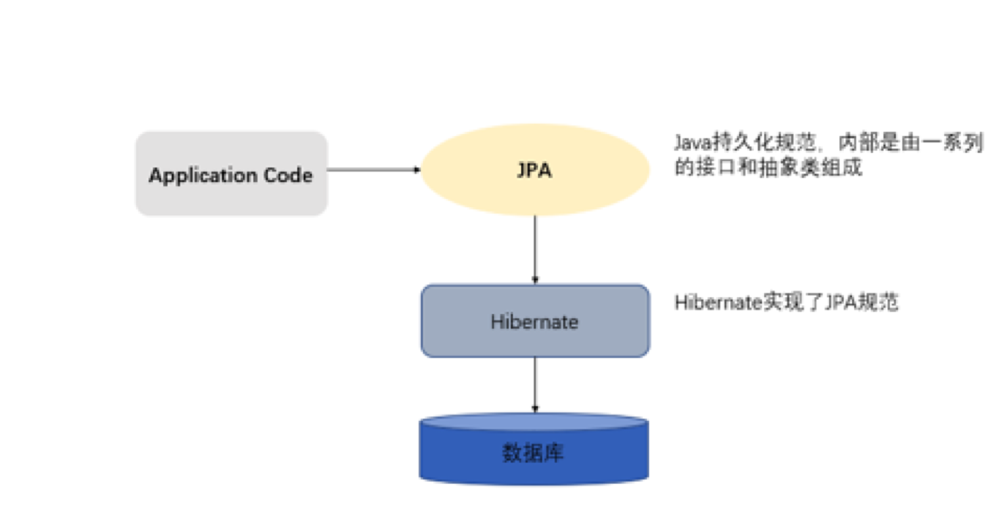
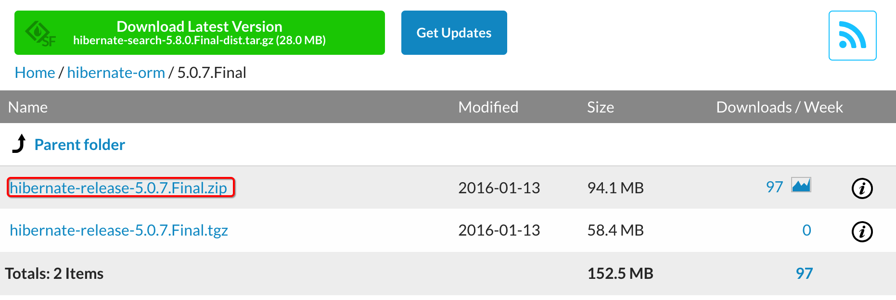
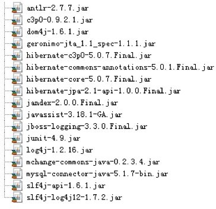
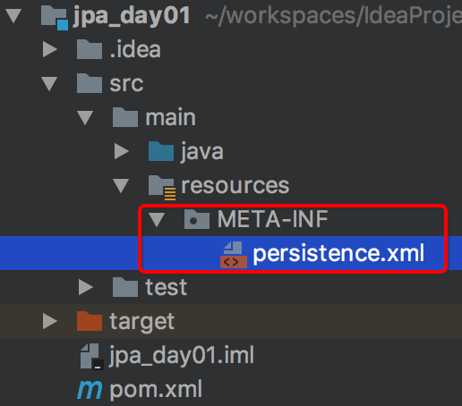
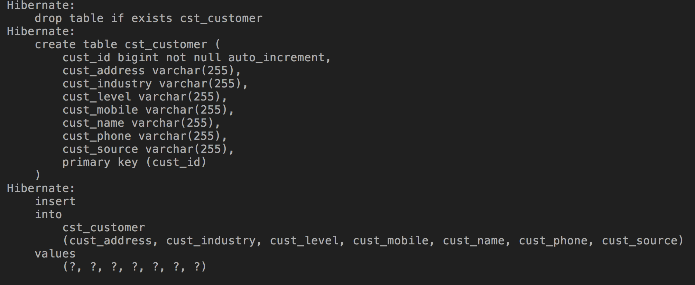
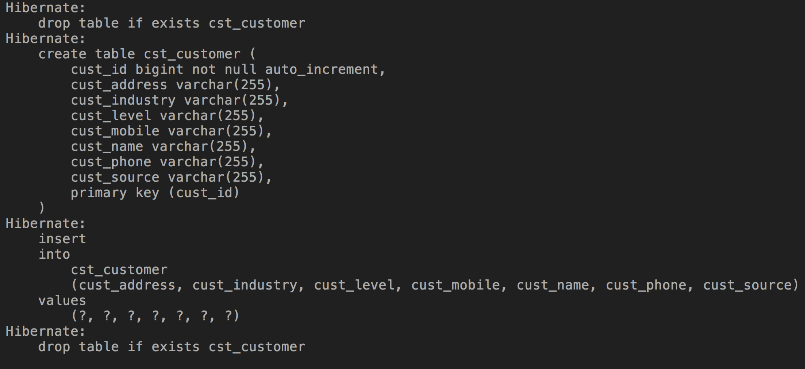
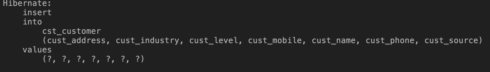
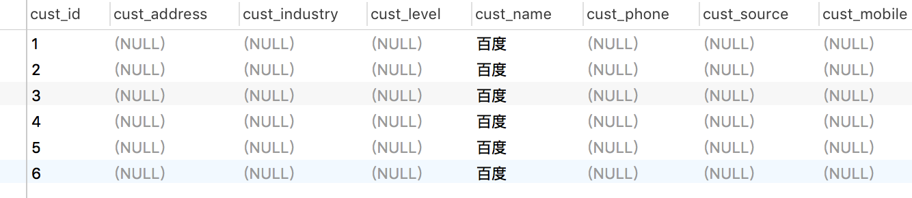
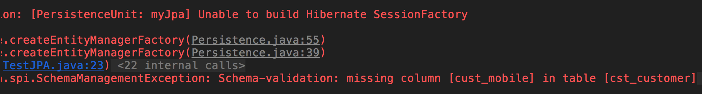
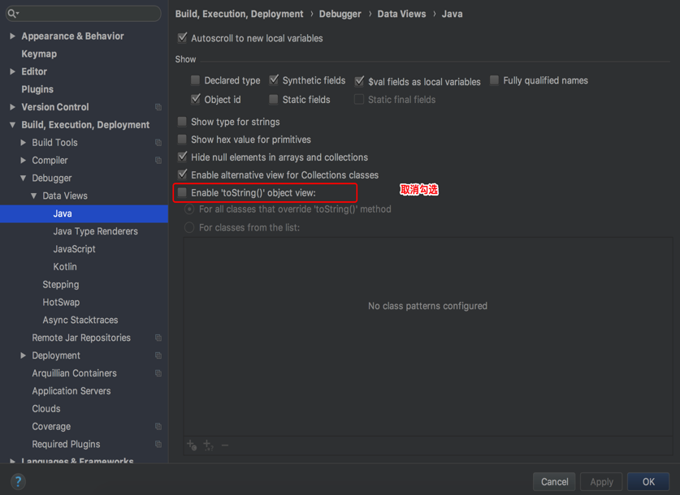

# 									Spring Data JPA第一天

课程介绍：

Spring Data JPA是除了mybatis以外另外的一个持久层的解决方案。

第一天：JPA

第二天：Spring Data JPA

第三天：多表的CRUD

# 1.ORM概述

## 1.1.什么是ORM	

ORM（Object-Relational Mapping） 表示对象关系映射。在面向对象的软件开发中，通过ORM，就可以把对象映射到关系型数据库中。只要有一套程序能够做到建立对象与数据库的关联，操作对象就可以直接操作数据库数据，就可以说这套程序实现了ORM对象关系映射。

简单的说：ORM就是建立实体类和数据库表之间的关系，从而达到操作实体类就相当于操作数据库表的目的。

## 1.2.为什么使用ORM

当实现一个应用程序时（不使用O/R Mapping），我们可能会写特别多数据访问层的代码，从数据库保存数据、修改数据、删除数据，而这些代码都是重复的。而使用ORM则会大大减少重复性代码。对象关系映射（Object Relational Mapping，简称ORM），主要实现程序对象到关系数据库数据的映射。 

## 1.3.常见ORM框架

常见的orm框架：

- Mybatis（ibatis）:一个半自动化的ORM框架，需要写sql语句。


- Hibernate：全自动化的ORM框架，不需要写sql语句，全部面向对象。

# 2.Hibernate与JPA概述

## 2.1.Hibernate概述

Hibernate是一个开放源代码的对象关系映射（ORM）框架，它对JDBC进行了非常轻量级的对象封装，它将POJO与数据库表建立映射关系，是一个全自动的orm框架，hibernate可以自动生成SQL语句，自动执行，使得Java程序员可以随心所欲的使用对象编程思维来操纵数据库。 

## 2.2.JPA概述

JPA的全称是Java Persistence API， 即Java 持久化规范，是SUN公司推出的一套基于ORM的规范，内部是由一系列的接口和抽象类构成。

 JPA通过JDK 5.0注解描述对象－关系表的映射关系，并将运行期的实体对象持久化到数据库中。

## 2.3.JPA的优势

**1.** **标准化**

   JPA 是 JCP 组织发布的 Java EE 标准之一，因此任何声称符合 JPA 标准的框架都遵循同样的架构，提供相同的访问API，这保证了基于JPA开发的企业应用能够经过少量的修改就能够在不同的JPA框架下运行。

**2.** **容器级特性的支持**

   JPA框架中支持大数据集、事务、并发等容器级事务，这使得 JPA 超越了简单持久化框架的局限，在企业应用发挥更大的作用。

**3.** **简单方便**

   JPA的主要目标之一就是提供更加简单的编程模型：在JPA框架下创建实体和创建Java 类一样简单，没有任何的约束和限制，只需要使用 javax.persistence.Entity进行注释，JPA的框架和接口也都非常简单，没有太多特别的规则和设计模式的要求，开发者可以很容易的掌握。JPA基于非侵入式原则设计，因此可以很容易的和其它框架或者容器集成

**4.** **查询能力**

   JPA的查询语言是面向对象而非面向数据库的，它以面向对象的自然语法构造查询语句，可以看成是Hibernate HQL的等价物。JPA定义了独特的JPQL（Java Persistence Query Language），JPQL是EJB QL的一种扩展，它是针对实体的一种查询语言，操作对象是实体，而不是关系数据库的表，而且能够支持批量更新和修改、JOIN、GROUP BY、HAVING 等通常只有 SQL 才能够提供的高级查询特性，甚至还能够支持子查询。

**5.** **高级特性**

   JPA 中能够支持面向对象的高级特性，如类之间的继承、多态和类之间的复杂关系，这样的支持能够让开发者最大限度的使用面向对象的模型设计企业应用，而不需要自行处理这些特性在关系数据库的持久化。

## 2.4.JPA与hibernate的关系

JPA规范本质上就是一种ORM规范，注意不是ORM框架——因为JPA并未提供ORM实现，它只是制订了一些规范，提供了一些编程的API接口，但具体实现则由服务厂商来提供实现。



JPA和Hibernate的关系就像JDBC和JDBC驱动的关系，JPA是规范，Hibernate除了作为ORM框架之外，它也是一种JPA实现。JPA怎么取代Hibernate呢？JDBC规范可以驱动底层数据库吗？答案是否定的，也就是说，如果使用JPA规范进行数据库操作，底层需要hibernate作为其实现类完成数据持久化工作。 

# 3.JPA入门

## 3.1.需求介绍

本章节我们是实现的功能是保存一个客户到数据库的客户表中。 

## 3.2.开发包介绍

由于JPA是sun公司制定的API规范，所以我们不需要导入额外的JPA相关的jar包，只需要导入JPA的提供商的jar包。我们选择Hibernate作为JPA的提供商，所以需要导入Hibernate的相关jar包。 

下载网址： 

http://sourceforge.net/projects/hibernate/files/hibernate-orm/5.0.7.Final/

页面显示如下图： 



## 3.3.搭建开发环境

### 3.3.1.导入jar包

对于JPA操作，只需要从hibernate提供的资料中找到我们需要的jar导入到工程中即可。 

传统工程导入jar包：



maven工程导入坐标：

```xml
<?xml version="1.0" encoding="UTF-8"?>
<project xmlns="http://maven.apache.org/POM/4.0.0"
         xmlns:xsi="http://www.w3.org/2001/XMLSchema-instance"
         xsi:schemaLocation="http://maven.apache.org/POM/4.0.0 http://maven.apache.org/xsd/maven-4.0.0.xsd">
    <modelVersion>4.0.0</modelVersion>

    <groupId>cn.itcast</groupId>
    <artifactId>jpa_day01</artifactId>
    <version>1.0-SNAPSHOT</version>

    <properties>
        <project.build.sourceEncoding>UTF-8</project.build.sourceEncoding>
        <hibernate.version>5.0.7.Final</hibernate.version>
        <junit.version>4.12</junit.version>
        <slf4j.version>1.6.6</slf4j.version>
        <mysql.version>5.1.6</mysql.version>
    </properties>

    <dependencies>
        <!-- junit -->
        <dependency>
            <groupId>junit</groupId>
            <artifactId>junit</artifactId>
            <version>${junit.version}</version>
            <scope>test</scope>
        </dependency>

        <!-- hibernate对jpa的支持包 -->
        <dependency>
            <groupId>org.hibernate</groupId>
            <artifactId>hibernate-entitymanager</artifactId>
            <version>${hibernate.version}</version>
        </dependency>
        
        <!-- log日志 -->
        <dependency>
            <groupId>org.slf4j</groupId>
            <artifactId>slf4j-log4j12</artifactId>
            <version>${slf4j.version}</version>
        </dependency>

        <!-- Mysql -->
        <dependency>
            <groupId>mysql</groupId>
            <artifactId>mysql-connector-java</artifactId>
            <version>${mysql.version}</version>
            <scope>runtime</scope>
        </dependency>
    </dependencies>
    <build>
        <plugins>
            <plugin>
                <groupId>org.apache.maven.plugins</groupId>
                <artifactId>maven-compiler-plugin</artifactId>
                <version>3.1</version>
                <configuration>
                    <source>1.8</source>
                    <target>1.8</target>
                </configuration>
            </plugin>
        </plugins>
    </build>
</project>
```

### 3.3.2.创建客户的数据库表和客户的实体类

创建客户的数据库表

```sql
 /*创建客户表*/
    CREATE TABLE cst_customer (
      cust_id bigint(32) NOT NULL AUTO_INCREMENT COMMENT '客户编号(主键)',
      cust_name varchar(32) NOT NULL COMMENT '客户名称(公司名称)',
      cust_source varchar(32) DEFAULT NULL COMMENT '客户信息来源',
      cust_industry varchar(32) DEFAULT NULL COMMENT '客户所属行业
        ',
      cust_level varchar(32) DEFAULT NULL COMMENT '客户级别',
      cust_address varchar(128) DEFAULT NULL COMMENT '客户联系地址',
      cust_phone varchar(64) DEFAULT NULL COMMENT '客户联系电话',
      PRIMARY KEY (`cust_id`)
    ) ENGINE=InnoDB AUTO_INCREMENT=1 DEFAULT CHARSET=utf8;
```

创建客户的实体类

```java
public class Customer implements Serializable{
    private Long custId;
    private String custName;
    private String custSource;
    private String custIndustry;
    private String custLevel;
    private String custAddress;
    private String custPhone;

    public Long getCustId() {
        return custId;
    }

    public void setCustId(Long custId) {
        this.custId = custId;
    }

    public String getCustName() {
        return custName;
    }

    public void setCustName(String custName) {
        this.custName = custName;
    }

    public String getCustSource() {
        return custSource;
    }

    public void setCustSource(String custSource) {
        this.custSource = custSource;
    }

    public String getCustIndustry() {
        return custIndustry;
    }

    public void setCustIndustry(String custIndustry) {
        this.custIndustry = custIndustry;
    }

    public String getCustLevel() {
        return custLevel;
    }

    public void setCustLevel(String custLevel) {
        this.custLevel = custLevel;
    }

    public String getCustAddress() {
        return custAddress;
    }

    public void setCustAddress(String custAddress) {
        this.custAddress = custAddress;
    }

    public String getCustPhone() {
        return custPhone;
    }

    public void setCustPhone(String custPhone) {
        this.custPhone = custPhone;
    }

    @Override
    public String toString() {
        return "Customer{" +
                "custId=" + custId +
                ", custName='" + custName + '\'' +
                ", custSource='" + custSource + '\'' +
                ", custIndustry='" + custIndustry + '\'' +
                ", custLevel='" + custLevel + '\'' +
                ", custAddress='" + custAddress + '\'' +
                ", custPhone='" + custPhone + '\'' +
                '}';
    }
}
```

### 3.3.3.编写实体类和数据库表的映射配置

在实体类上使用JPA注解的形式配置映射关系

```java
@Entity
@Table(name = "cst_customer")
public class Customer implements Serializable{
    @Id
    @GeneratedValue(strategy = GenerationType.IDENTITY)
    @Column(name="cust_id")
    private Long custId;
    @Column(name="cust_name")
    private String custName;
    @Column(name="cust_source")
    private String custSource;
    @Column(name="cust_industry")
    private String custIndustry;
    @Column(name="cust_level")
    private String custLevel;
    @Column(name="cust_address")
    private String custAddress;
    @Column(name="cust_phone")
    private String custPhone;


    public Long getCustId() {
        return custId;
    }

    public void setCustId(Long custId) {
        this.custId = custId;
    }

    public String getCustName() {
        return custName;
    }

    public void setCustName(String custName) {
        this.custName = custName;
    }

    public String getCustSource() {
        return custSource;
    }

    public void setCustSource(String custSource) {
        this.custSource = custSource;
    }

    public String getCustIndustry() {
        return custIndustry;
    }

    public void setCustIndustry(String custIndustry) {
        this.custIndustry = custIndustry;
    }

    public String getCustLevel() {
        return custLevel;
    }

    public void setCustLevel(String custLevel) {
        this.custLevel = custLevel;
    }

    public String getCustAddress() {
        return custAddress;
    }

    public void setCustAddress(String custAddress) {
        this.custAddress = custAddress;
    }

    public String getCustPhone() {
        return custPhone;
    }

    public void setCustPhone(String custPhone) {
        this.custPhone = custPhone;
    }

    @Override
    public String toString() {
        return "Customer{" +
                "custId=" + custId +
                ", custName='" + custName + '\'' +
                ", custSource='" + custSource + '\'' +
                ", custIndustry='" + custIndustry + '\'' +
                ", custLevel='" + custLevel + '\'' +
                ", custAddress='" + custAddress + '\'' +
                ", custPhone='" + custPhone + '\'' +
                '}';
    }
}
```

常用注解的说明：

@Entity

         作用：指定当前类是实体类。

@Table

         作用：指定实体类和表之间的对应关系。
    
         属性：
    
            name：指定数据库表的名称

@Id

         作用：指定当前字段是主键。

@GeneratedValue

         作用：指定主键的生成方式。
    
         属性：
    
            strategy ：指定主键生成策略。

@Column

         作用：指定实体类属性和数据库表之间的对应关系
    
         属性：
    
            name：指定数据库表的列名称。
    
            unique：是否唯一  
    
            nullable：是否可以为空  
    
            inserttable：是否可以插入  
    
            updateable：是否可以更新  
    
            columnDefinition: 定义建表时创建此列的DDL  
    
            secondaryTable: 从表名。如果此列不建在主表上（默认建在主表），该属性定义该列所在从表的名字

### 3.4.配置JPA的核心配置文件

在java工程的src路径下创建一个名为META-INF的文件夹，在此文件夹下创建一个名为persistence.xml的配置文件



```xml
<?xml version="1.0" encoding="UTF-8"?>
<persistence xmlns="http://java.sun.com/xml/ns/persistence" version="2.0">

    <!--配置持久化单元
      name：持久化单元名称
      transaction-type：事务类型
         RESOURCE_LOCAL：本地事务管理
         JTA：分布式事务管理 -->
    <persistence-unit name="myJpa" transaction-type="RESOURCE_LOCAL">
       <!--指定JPA规范的提供商-->
        <provider>org.hibernate.jpa.HibernatePersistenceProvider</provider>
        <properties>
            <!-- 数据库驱动 -->
            <property name="javax.persistence.jdbc.driver" value="com.mysql.jdbc.Driver"/>
            <!-- 数据库地址 -->
            <property name="javax.persistence.jdbc.url" value="jdbc:mysql://localhost:3306/springdatajpa"/>
            <!-- 数据库用户名 -->
            <property name="javax.persistence.jdbc.user" value="root"/>
            <!-- 数据库密码 -->
            <property name="javax.persistence.jdbc.password" value="123456"/>
            <!--jpa提供商的可选配置：我们的JPA规范的提供商为hibernate，
            所以jpa的核心配置中兼容hibernate的配置 -->
            <!--打印sql语句-->
            <property name="hibernate.show_sql" value="true"/>
            <!--格式化sql语句-->
            <property name="hibernate.format_sql" value="true"/>
        </properties>
    </persistence-unit>
</persistence>
```

## 3.4.实现保存操作

```java
@Test
public void test1() {
    Customer customer = new Customer();
    customer.setCustName("百度");

    /**
     * 创建实体管理器工厂，借助Persistence的静态方法获取
     *        其中传递的参数为持久化单元名称，需要jpa配置文件中指定
     */
    EntityManagerFactory factory = Persistence.createEntityManagerFactory("myJpa");
    //创建实体管理器
    EntityManager em = factory.createEntityManager();
    //获取事务
    EntityTransaction tx = em.getTransaction();
    //开启事务
    tx.begin();
    //保存
    em.persist(customer);
    //提交事务
    tx.commit();
    //关闭实体管理器
    em.close();
    //关闭实体管理器工厂
    factory.close();
}
```

## 3.5.hbm2ddl.auto取值的说明

在persistence.xml中还可以配置一个可选的属性：hibernate.hbm2ddl.auto，可以取的值有四个，分别是：create | create-drop | update | validate（默认）

### 3.5.1.create

每次加载hibernate时，先删除表，再创建表，会丢失表中的数据

在persistence.xml中配置hibernate.hbm2ddl.auto的值为create，如下：

```xml
<?xml version="1.0" encoding="UTF-8"?>
<persistence xmlns="http://java.sun.com/xml/ns/persistence" version="2.0">

    <!--配置持久化单元
      name：持久化单元名称
      transaction-type：事务类型
         RESOURCE_LOCAL：本地事务管理
         JTA：分布式事务管理 -->
    <persistence-unit name="myJpa" transaction-type="RESOURCE_LOCAL">
       <!--指定JPA规范的提供商-->
        <provider>org.hibernate.jpa.HibernatePersistenceProvider</provider>
        <properties>
            <!-- 数据库驱动 -->
            <property name="javax.persistence.jdbc.driver" value="com.mysql.jdbc.Driver"/>
            <!-- 数据库地址 -->
            <property name="javax.persistence.jdbc.url" value="jdbc:mysql://localhost:3306/springdatajpa"/>
            <!-- 数据库用户名 -->
            <property name="javax.persistence.jdbc.user" value="root"/>
            <!-- 数据库密码 -->
            <property name="javax.persistence.jdbc.password" value="123456"/>
            <!--jpa提供商的可选配置：我们的JPA规范的提供商为hibernate，
            所以jpa的核心配置中兼容hibernate的配置 -->
            <!--打印sql语句-->
            <property name="hibernate.show_sql" value="true"/>
            <!--格式化sql语句-->
            <property name="hibernate.format_sql" value="true"/>
            <property name="hibernate.hbm2ddl.auto" value="create"/>
        </properties>
    </persistence-unit>
</persistence>
```

测试结果如下： 



### 3.5.2.create-drop

每次加载hibernate时，先删除表，再创建表，当程序结束时（EntityManagerFactory关闭）再删除表

在persistence.xml中配置hibernate.hbm2ddl.auto的值为create-drop，如下：

```xml
 <property name="hibernate.hbm2ddl.auto" value="create-drop"/>
```

测试结果如下： 



### 3.5.3.update

如果没有表，会先创建表，但不是不会打印建表语句；如果有表，就检测实体类和表结构是否一致，如果不一致，就更新表结构。

在persistence.xml中配置hibernate.hbm2ddl.auto的值为update，如下：

```xml
<property name="hibernate.hbm2ddl.auto" value="update"/> 
```

在Customer类中新增一个属性custMobile，表结构保持不变：

```java
@Entity
@Table(name = "cst_customer")
public class Customer implements Serializable{
    @Id
    @GeneratedValue(strategy = GenerationType.IDENTITY)
    @Column(name="cust_id")
    private Long custId;
    @Column(name="cust_name")
    private String custName;
    @Column(name="cust_source")
    private String custSource;
    @Column(name="cust_industry")
    private String custIndustry;
    @Column(name="cust_level")
    private String custLevel;
    @Column(name="cust_address")
    private String custAddress;
    @Column(name="cust_phone")
    private String custPhone;

    @Column(name="cust_mobile")
    private String custMobile;

    public Long getCustId() {
        return custId;
    }

    public void setCustId(Long custId) {
        this.custId = custId;
    }

    public String getCustName() {
        return custName;
    }

    public void setCustName(String custName) {
        this.custName = custName;
    }

    public String getCustSource() {
        return custSource;
    }

    public void setCustSource(String custSource) {
        this.custSource = custSource;
    }

    public String getCustIndustry() {
        return custIndustry;
    }

    public void setCustIndustry(String custIndustry) {
        this.custIndustry = custIndustry;
    }

    public String getCustLevel() {
        return custLevel;
    }

    public void setCustLevel(String custLevel) {
        this.custLevel = custLevel;
    }

    public String getCustAddress() {
        return custAddress;
    }

    public void setCustAddress(String custAddress) {
        this.custAddress = custAddress;
    }

    public String getCustPhone() {
        return custPhone;
    }

    public void setCustPhone(String custPhone) {
        this.custPhone = custPhone;
    }

    public String getCustMobile() {
        return custMobile;
    }

    public void setCustMobile(String custMobile) {
        this.custMobile = custMobile;
    }

    @Override
    public String toString() {
        return "Customer{" +
                "custId=" + custId +
                ", custName='" + custName + '\'' +
                ", custSource='" + custSource + '\'' +
                ", custIndustry='" + custIndustry + '\'' +
                ", custLevel='" + custLevel + '\'' +
                ", custAddress='" + custAddress + '\'' +
                ", custPhone='" + custPhone + '\'' +
                '}';
    }
}
```

测试结果如下： 



观察cst_customer表，发现多了cust_mobile列： 



### 3.5.4.validate

没有表的情况下，不会创建表；如果有表，当实体类和表结构不一致，不会更新表结构，直接报错；

在persistence.xml中配置hbm2ddl.auto的值为validate:

```xml
<property name="hibernate.hbm2ddl.auto" value="validate"/>
```

先保证表结构维持原样，实体类中新增一个属性cust_mobile，测试结果如下： 



# 4.JPA中的主键生成策略

基于annotation的hibernate主键标识为@Id, 其生成规则由@GeneratedValue设定的.这里的@Id和@GeneratedValue都是JPA的标准用法。 

JPA提供的四种标准主键生成策略为TABLE,SEQUENCE,IDENTITY,AUTO。

具体说明如下：

## 4.1.IDENTITY

主键由数据库自动生成（主要是自动增长型）

 用法：

```java
 	@Id  
    @GeneratedValue(strategy = GenerationType.IDENTITY) 
    private Long custId;

```

## 4.2.SEQUENCE

根据底层数据库的序列来生成主键，条件是数据库支持序列。

用法：

```java
	@Id  
    @GeneratedValue(strategy = GenerationType.SEQUENCE,generator="payablemoney_seq")  
    @SequenceGenerator(name="payablemoney_seq", sequenceName="seq_payment")  
	private Long custId;


    //@SequenceGenerator源码中的定义
    @Target({TYPE, METHOD, FIELD})   
    @Retention(RUNTIME)  
    public @interface SequenceGenerator {  
       //表示该表主键生成策略的名称，它被引用在@GeneratedValue中设置的“generator”值中
       String name();  
       //属性表示生成策略用到的数据库序列名称。
       String sequenceName() default "";  
       //表示主键初识值，默认为0
       int initialValue() default 0;  
       //表示每次主键值增加的大小，例如设置1，则表示每次插入新记录后自动加1，默认为50
       int allocationSize() default 50;  
    }

```

## 4.3.TABLE

使用一个特定的数据库表格来保存主键。

用法：

```java
 	@Id  
    @GeneratedValue(strategy = GenerationType.TABLE, generator="pk_gen")  
    @TableGenerator(name = "pk_gen",  
        table="tb_generator",  
        pkColumnName="gen_name",  
        valueColumnName="gen_value",  
        pkColumnValue="PAYABLEMOENY_PK",  
        allocationSize=1  
    ) 
	private Long custId;


//@TableGenerator的定义：
    @Target({TYPE, METHOD, FIELD})   
    @Retention(RUNTIME)  
    public @interface TableGenerator {  
      //表示该表主键生成策略的名称，它被引用在@GeneratedValue中设置的“generator”值中
      String name();  
      //表示表生成策略所持久化的表名，例如，这里表使用的是数据库中的“tb_generator”。
      String table() default "";  
      //catalog和schema具体指定表所在的目录名或是数据库名
      String catalog() default "";  
      String schema() default "";  
      //属性的值表示在持久化表中，该主键生成策略所对应键值的名称。例如在“tb_generator”中将“gen_name”作为主键的键值
      String pkColumnName() default "";  
      //属性的值表示在持久化表中，该主键当前所生成的值，它的值将会随着每次创建累加。例如，在“tb_generator”中将“gen_value”作为主键的值 
      String valueColumnName() default "";  
      //属性的值表示在持久化表中，该生成策略所对应的主键。例如在“tb_generator”表中，将“gen_name”的值为“CUSTOMER_PK”。 
      String pkColumnValue() default "";  
      //表示主键初始值，默认为0。 
      int initialValue() default 0;  
      //表示每次主键值增加的大小，例如设置成1，则表示每次创建新记录后自动加1，默认为50。
      int allocationSize() default 50;  
      UniqueConstraint[] uniqueConstraints() default {};  
    } 

 //这里应用表tb_generator，定义为 ：
    CREATE TABLE  tb_generator (  
      id NUMBER NOT NULL,  
      gen_name VARCHAR2(255) NOT NULL,  
      gen_value NUMBER NOT NULL,  
      PRIMARY KEY(id)  
    )


```


## 4.4.AUTO

程序根据底层数据库类型来选择一种合适的策略，如果是mysql数据库，则选择用table来存储主键，实现自增的效果。

用法：

```java
 	@Id  
    @GeneratedValue(strategy = GenerationType.AUTO)  
    private Long custId;

```

# 5.JPA的API介绍

## 5.1.Persistence类

Persistence类主要作用是用于获取EntityManagerFactory对象的 。通过调用该类的createEntityManagerFactory静态方法，根据配置文件中持久化单元名称创建EntityManagerFactory。 

```java
//1. 创建 EntitymanagerFactory
String unitName = "myJpa";
EntityManagerFactory factory= Persistence.createEntityManagerFactory(unitName);
```

## 5.2.EntityManagerFactory

EntityManagerFactory 接口主要用来创建 EntityManager 实例

```java
//创建实体管理类
EntityManager em = factory.createEntityManager();
```

由于EntityManagerFactory 是一个线程安全的对象（即多个线程访问同一个EntityManagerFactory 对象不会有线程安全问题），并且EntityManagerFactory 的创建极其浪费资源，所以在使用JPA编程时，我们可以对EntityManagerFactory 的创建进行优化，只需要做到一个工程只存在一个EntityManagerFactory 即可 。

```java
public class JPAUtil {
    private static final EntityManagerFactory factory;

    static {
        factory = Persistence.createEntityManagerFactory("myJpa");
    }

    public static EntityManager getEntityManager(){
        return factory.createEntityManager();
    }


}
```

创建单元测试方法，测试JPAUtil工具类是否正确： 

```java
/**
 * 测试JPAUtil工具类
 */
@Test
public void test2() {
    Customer customer = new Customer();
    customer.setCustName("传智播客");

    EntityManager em = JPAUtil.getEntityManager();
    EntityTransaction tx = em.getTransaction();
    tx.begin();

    em.persist(customer);

    tx.commit();
    em.close();
}
```


## 5.3.EntityManager

在 JPA 规范中, EntityManager是完成持久化操作的核心对象。实体类作为普通 java对象，只有在调用 EntityManager将其持久化后才会变成持久化对象。EntityManager对象在一组实体类与底层数据源之间进行 O/R 映射的管理。它可以用来管理和更新 Entity Bean, 根椐主键查找 Entity Bean, 还可以通过JPQL语句查询实体。

 我们可以通过调用EntityManager的方法完成获取事务，以及持久化数据库的操作

 方法说明：

	getTransaction : 获取事务对象
	
	persist ： 保存操作 
	
	merge ： 更新操作 
	
	remove ： 删除操作 
	
	find/getReference ： 根据id查询

## 5.4.EntityTransaction

在 JPA 规范中, EntityTransaction是完成事务操作的核心对象，对于EntityTransaction在我们的java代码中承接的功能比较简单。方法说明：

	begin：开启事务 
	
	commit：提交事务 
	
	rollback：回滚事务

# 6.使用JPA完成增删改查操作

## 6.1.保存

```java
@Test
public void testSave() {
    Customer customer = new Customer();
    customer.setCustName("传智播客");

    EntityManager em = JPAUtil.getEntityManager();
    EntityTransaction tx = em.getTransaction();
    tx.begin();

    em.persist(customer);

    tx.commit();
    em.close();

}
```

## 6.2.根据id查询

```java
	@Test
    public void testFind() {
        EntityManager em = JPAUtil.getEntityManager();
        EntityTransaction tx = em.getTransaction();
        tx.begin();

        Customer customer = em.find(Customer.class, 1L);
        System.out.println(customer);
        tx.commit();
        em.close();
    }
```

find方法是会使用缓存的

```java
@Test
public void testFind2() {
    EntityManager em = JPAUtil.getEntityManager();
    EntityTransaction tx = em.getTransaction();
    tx.begin();

    Customer customer1 = em.find(Customer.class,1L);
    Customer customer2 = em.find(Customer.class,1L);
    System.out.println(customer1==customer2);//只发送一条sql语句，比较结果为true
    tx.commit();
    em.close();

}
```

使用延迟加载策略

```java
 	/**
     * 查询一个： 使用延迟加载策略
     */
    @Test
    public void testFind3() {
        EntityManager em = JPAUtil.getEntityManager();
        EntityTransaction tx = em.getTransaction();
        tx.begin();

        Customer customer = em.getReference(Customer.class,1L);
        System.out.println(customer);
        tx.commit();
        em.close();
    }
```

可能测试时看不到延迟加载的效果，是因为idea工具的原因，需要这么来设置一下： 



关于getReference方法的说明：

- 延迟加载，调用getReference时，不会发送sql语句查询数据库，而是当使用这个对象时（获取对象的属性），再去查询数据库；


- 返回的是代理对象；

## 6.3.修改

先根据id查询一个对象，再更新：

```java
@Test
public void testUpdate() {
    EntityManager em = JPAUtil.getEntityManager();
    EntityTransaction tx = em.getTransaction();
    tx.begin();

    //先查询
    Customer customer = em.find(Customer.class, 1L);
    //修改对象
    customer.setCustAddress("航头");


    tx.commit();//事务提交时，自动更新
    em.close();
}

```

也可以先new一个对象，给对象指定id,指定新的属性值，再调用meger方法更新这个对象：

```java
@Test
public void testUpdate2() {
    EntityManager em = JPAUtil.getEntityManager();
    EntityTransaction tx = em.getTransaction();
    tx.begin();

    Customer customer = new Customer();
    customer.setCustId(1L);
    customer.setCustName("黑马程序员");
    customer.setCustAddress("江苏");

    em.merge(customer);//更新对象

    tx.commit();
    em.close();
}

```

## 6.4.删除

```java
	@Test
    public void testDelete() {
        EntityManager em = JPAUtil.getEntityManager();
        EntityTransaction tx = em.getTransaction();
        tx.begin();

        //先查询
        Customer customer = em.find(Customer.class, 1L);
        //再删除
        em.remove(customer);

        tx.commit();
        em.close();
    }
```

注意：不能直接new一个对象，然后删除。

## 6.5.JPA中的复杂查询

JPQL全称Java Persistence Query Language

 基于首次在EJB2.0中引入的EJB查询语言(EJB QL),Java持久化查询语言(JPQL)是一种可移植的查询语言，旨在以面向对象表达式语言的表达式，将SQL语法和简单查询语义绑定在一起·使用这种语言编写的查询是可移植的，可以被编译成所有主流数据库服务器上的SQL。

 其特征与原生SQL语句类似，并且完全面向对象，通过类名和属性访问，而不是表名和列名。

sql:select * from cst_customer where cust_name = ?

jpql:from Customer where custName = ?

### 6.5.1.查询全部

```java
 @Test
    public void findAll() {
        EntityManager em = JPAUtil.getEntityManager();
        EntityTransaction tx = em.getTransaction();
        tx.begin();

        //创建查询对象,写的是JPQL语句
        Query query = em.createQuery("from Customer");
        List<Customer> list = query.getResultList();
        for (Customer customer : list) {
            System.out.println(customer);
        }
        tx.commit();
        em.close();
    }
```

### 6.5.2.分页查询

```java
	@Test
    public void findPage() {
        EntityManager em = JPAUtil.getEntityManager();
        EntityTransaction tx = em.getTransaction();
        tx.begin();

        //创建查询对象,写的是JPQL语句
        Query query = em.createQuery("from Customer");
        query.setFirstResult(0);
        query.setMaxResults(2);
        List<Customer> list = query.getResultList();
        for (Customer customer : list) {
            System.out.println(customer);
        }
        tx.commit();
        em.close();
    }
```

### 6.5.3.条件查询

```java
 	@Test
    public void findLike() {
        EntityManager em = JPAUtil.getEntityManager();
        EntityTransaction tx = em.getTransaction();
        tx.begin();

        //创建查询对象,写的是JPQL语句
        Query query = em.createQuery("from Customer where custName like ?");
        //给占位符设置值
        query.setParameter(1,"%传智%");
        List<Customer> list = query.getResultList();
        for (Customer customer : list) {
            System.out.println(customer);
        }

        tx.commit();
        em.close();
    }
```

### 6.5.4.排序查询

```java
 @Test
    public void findOrder() {
        EntityManager em = JPAUtil.getEntityManager();
        EntityTransaction tx = em.getTransaction();
        tx.begin();

        //创建查询对象,写的是JPQL语句
        Query query = em.createQuery("from Customer order by custId desc");
        List<Customer> list = query.getResultList();
        for (Customer customer : list) {
            System.out.println(customer);
        }

        tx.commit();
        em.close();
    }
```

### 6.5.5.统计查询

```java
	@Test
    public void findCount() {
        EntityManager em = JPAUtil.getEntityManager();
        EntityTransaction tx = em.getTransaction();
        tx.begin();

        //创建查询对象,写的是JPQL语句
        Query query = em.createQuery("select count(*) from Customer");
        Long total = (Long) query.getSingleResult();
        System.out.println(total);

        tx.commit();
        em.close();
    }
```

小结：

1、ORM、Hibernate、JPA

2、JPA环境的搭建

3、hbm2ddl.auto的值

4、主键生成策略

5、基本的CRUD、JPQL

