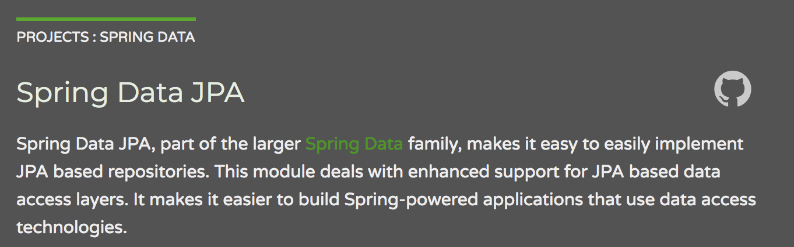
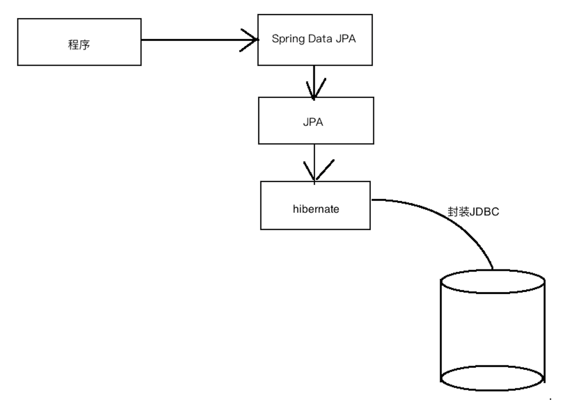
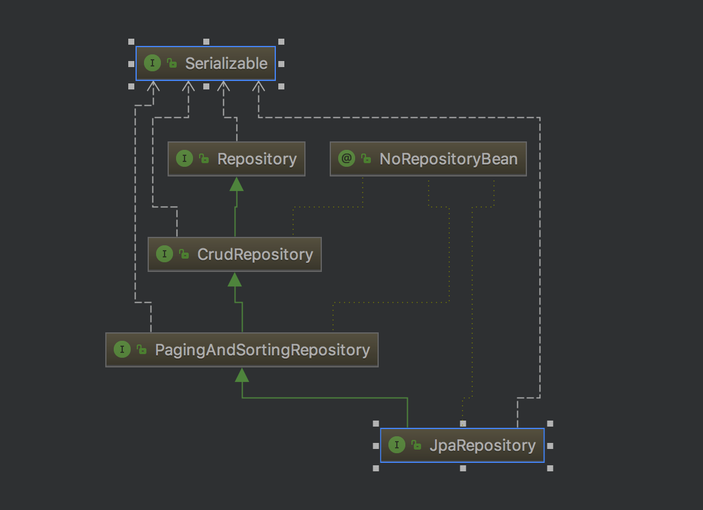
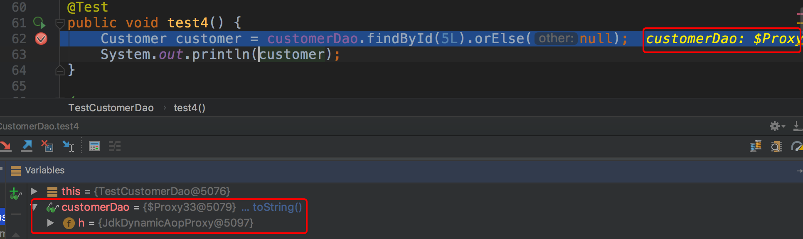
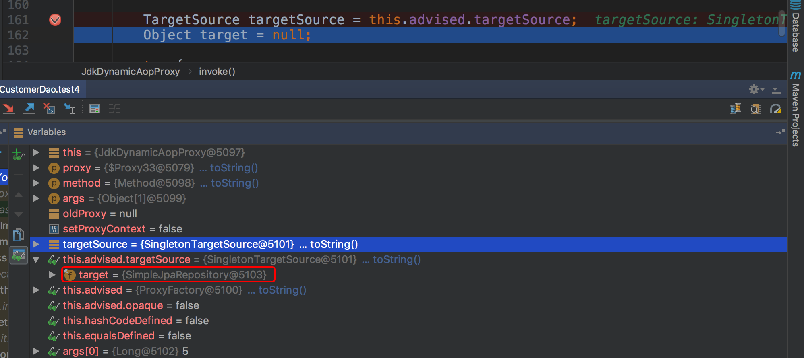
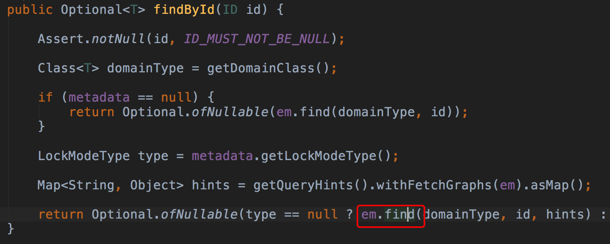
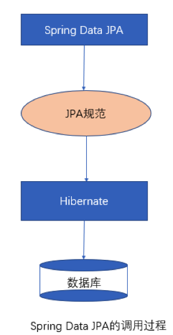
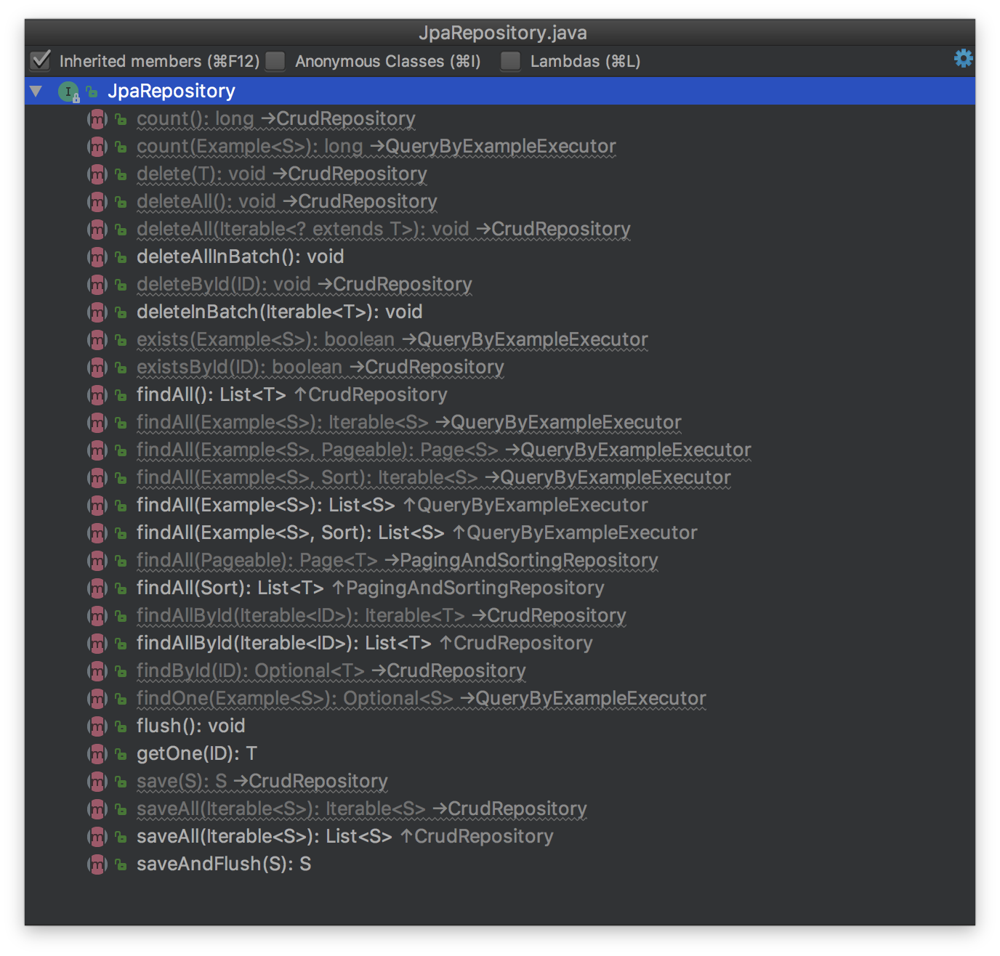
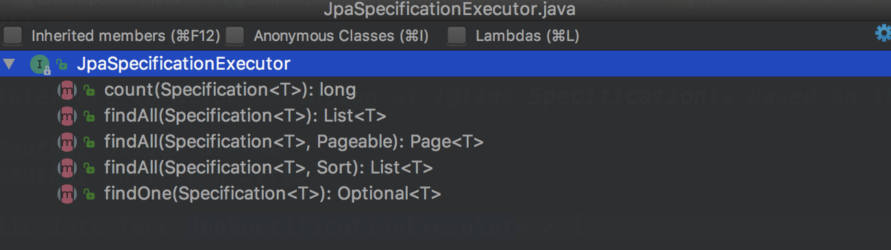

# 								Spring Data JPA第二天

# 1.Spring Data JPA的概述

## 1.1.Spring Data JPA概述



Spring Data JPA 是 Spring 基于 ORM 框架、JPA 规范的基础上封装的一套JPA应用框架，可使开发者用极简的代码即可实现对数据库的访问和操作。它提供了包括增删改查等在内的常用功能，且易于扩展！学习并使用 Spring Data JPA 可以极大提高开发效率！

 Spring Data JPA 让我们解脱了DAO层的操作，基本上所有CRUD都可以依赖于它来实现,在实际的工作工程中，推荐使用Spring Data JPA + ORM（如：hibernate）完成操作，这样在切换不同的ORM框架时提供了极大的方便，同时也使数据库层操作更加简单，方便解耦

## 1.2.Spring Data JPA 与 JPA和hibernate之间的关系

JPA是一套规范，内部是有接口和抽象类组成的。hibernate是一套成熟的ORM框架，而且Hibernate实现了JPA规范，所以也可以称hibernate为JPA的一种实现方式，我们使用JPA的API编程，意味着站在更高的角度上看待问题（面向接口编程）

 Spring Data JPA是Spring提供的一套对JPA操作更加高级的封装，是在JPA规范下的专门用来进行数据持久化的解决方案。



# 2.Spring Data JPA的快速入门

## 2.1.需求说明

使用Spring Data JPA完成客户的基本CRUD操作

## 2.2.搭建Spring Data JPA的开发环境

### 2.2.1.引入Spring Data JPA的坐标

使用Spring Data JPA，需要整合Spring与Spring Data JPA，并且需要提供JPA的服务提供者hibernate，所以需要导入spring相关坐标，spring data jpa坐标，hibernate坐标，数据库驱动坐标等。

```xml
<?xml version="1.0" encoding="UTF-8"?>
<project xmlns="http://maven.apache.org/POM/4.0.0"
         xmlns:xsi="http://www.w3.org/2001/XMLSchema-instance"
         xsi:schemaLocation="http://maven.apache.org/POM/4.0.0 http://maven.apache.org/xsd/maven-4.0.0.xsd">
    <modelVersion>4.0.0</modelVersion>

    <groupId>cn.itcast</groupId>
    <artifactId>jpa_day02</artifactId>
    <version>1.0-SNAPSHOT</version>
    <properties>
        <spring.version>5.0.7.RELEASE</spring.version>
        <hibernate.version>5.0.7.Final</hibernate.version>
        <springdatajpa.version>2.0.1.RELEASE</springdatajpa.version>
        <slf4j.version>1.6.6</slf4j.version>
        <hikari.version>3.2.0</hikari.version>
        <mysql.version>5.1.6</mysql.version>
        <junit.version>4.12</junit.version>
    </properties>

    <dependencies>
        <!-- junit单元测试 -->
        <dependency>
            <groupId>junit</groupId>
            <artifactId>junit</artifactId>
            <version>${junit.version}</version>
            <scope>test</scope>
        </dependency>
        <dependency>
            <groupId>org.springframework</groupId>
            <artifactId>spring-test</artifactId>
            <version>${spring.version}</version>
        </dependency>
        <!-- spring -->
        <dependency>
            <groupId>org.springframework</groupId>
            <artifactId>spring-context</artifactId>
            <version>${spring.version}</version>
        </dependency>

        <dependency>
            <groupId>org.springframework</groupId>
            <artifactId>spring-aspects</artifactId>
            <version>${spring.version}</version>
        </dependency>

        <dependency>
            <groupId>org.springframework</groupId>
            <artifactId>spring-orm</artifactId>
            <version>${spring.version}</version>
        </dependency>

        <!-- hibernate -->
        <dependency>
            <groupId>org.hibernate</groupId>
            <artifactId>hibernate-core</artifactId>
            <version>${hibernate.version}</version>
        </dependency>

        <dependency>
            <groupId>org.hibernate</groupId>
            <artifactId>hibernate-entitymanager</artifactId>
            <version>${hibernate.version}</version>
        </dependency>

        <dependency>
            <groupId>com.zaxxer</groupId>
            <artifactId>HikariCP</artifactId>
            <version>${hikari.version}</version>
        </dependency>

        <!-- log -->
        <dependency>
            <groupId>org.slf4j</groupId>
            <artifactId>slf4j-log4j12</artifactId>
            <version>${slf4j.version}</version>
        </dependency>

        <dependency>
            <groupId>mysql</groupId>
            <artifactId>mysql-connector-java</artifactId>
            <version>${mysql.version}</version>
        </dependency>

        <dependency>
            <groupId>org.springframework.data</groupId>
            <artifactId>spring-data-jpa</artifactId>
            <version>${springdatajpa.version}</version>
        </dependency>


        <!-- el 使用spring data jpa 必须引入 -->
        <dependency>
            <groupId>javax.el</groupId>
            <artifactId>javax.el-api</artifactId>
            <version>2.2.4</version>
        </dependency>

        <dependency>
            <groupId>org.glassfish.web</groupId>
            <artifactId>javax.el</artifactId>
            <version>2.2.4</version>
        </dependency>

    </dependencies>
    <build>
        <plugins>
            <plugin>
                <groupId>org.apache.maven.plugins</groupId>
                <artifactId>maven-compiler-plugin</artifactId>
                <version>3.1</version>
                <configuration>
                    <source>1.8</source>
                    <target>1.8</target>
                </configuration>
            </plugin>
        </plugins>
    </build>
    
</project>
```

### 2.2.2.整合Spring Data JPA与Spring

```xml
<?xml version="1.0" encoding="UTF-8"?>
<beans xmlns="http://www.springframework.org/schema/beans"
       xmlns:xsi="http://www.w3.org/2001/XMLSchema-instance" xmlns:aop="http://www.springframework.org/schema/aop"
       xmlns:context="http://www.springframework.org/schema/context"
       xmlns:jdbc="http://www.springframework.org/schema/jdbc" xmlns:tx="http://www.springframework.org/schema/tx"
       xmlns:jpa="http://www.springframework.org/schema/data/jpa" xmlns:task="http://www.springframework.org/schema/task"
       xsi:schemaLocation="
		http://www.springframework.org/schema/beans http://www.springframework.org/schema/beans/spring-beans.xsd
		http://www.springframework.org/schema/aop http://www.springframework.org/schema/aop/spring-aop.xsd
		http://www.springframework.org/schema/context http://www.springframework.org/schema/context/spring-context.xsd
		http://www.springframework.org/schema/jdbc http://www.springframework.org/schema/jdbc/spring-jdbc.xsd
		http://www.springframework.org/schema/tx http://www.springframework.org/schema/tx/spring-tx.xsd
		http://www.springframework.org/schema/data/jpa
		http://www.springframework.org/schema/data/jpa/spring-jpa.xsd">


    <bean id="dataSource" class="com.zaxxer.hikari.HikariDataSource">
        <property name="driverClassName" value="com.mysql.jdbc.Driver"/>
        <property name="jdbcUrl" value="jdbc:mysql://localhost:3306/springdatajpa"/>
        <property name="username" value="root"/>
        <property name="password" value="123456"/>
    </bean>

    <!--把EntityManagerFactory交给spring管理-->
    <bean id="entityManagerFactory" class="org.springframework.orm.jpa.LocalContainerEntityManagerFactoryBean">
        <!--注入数据源-->
        <property name="dataSource" ref="dataSource"/>
        <!--扫描实体类所在的包-->
        <property name="packagesToScan" value="cn.itcast.domain"/>
        <!--JPA提供商-->
        <property name="persistenceProvider">
            <bean class="org.hibernate.jpa.HibernatePersistenceProvider"/>
        </property>
        <property name="jpaVendorAdapter">
            <bean class="org.springframework.orm.jpa.vendor.HibernateJpaVendorAdapter">
                <property name="generateDdl" value="true"/>
                <property name="database" value="MYSQL"/>
                <property name="databasePlatform" value="org.hibernate.dialect.MySQLDialect"/>
                <property name="showSql" value="true"/>
             </bean>
        </property>
        <property name="jpaDialect">
            <bean class="org.springframework.orm.jpa.vendor.HibernateJpaDialect"/>
        </property>
    </bean>

    <bean id="transactionManager" class="org.springframework.orm.jpa.JpaTransactionManager">
        <property name="entityManagerFactory" ref="entityManagerFactory"/>
    </bean>
	<!-- 整合spring data jpa-->
    <jpa:repositories base-package="cn.itcast.dao" transaction-manager-ref="transactionManager" entity-manager-factory-ref="entityManagerFactory"/>
</beans>
```

### 2.2.3.使用JPA注解配置映射关系

我们使用昨天案例中的Customer实体类对象，已经配置好了映射关系

```java
@Entity
@Table(name = "cst_customer")
public class Customer {
    @Id
    @GeneratedValue(strategy = GenerationType.IDENTITY)
    @Column(name="cust_id")
    private Long custId;
    @Column(name="cust_name")
    private String custName;
    @Column(name="cust_source")
    private String custSource;
    @Column(name="cust_industry")
    private String custIndustry;
    @Column(name="cust_level")
    private String custLevel;
    @Column(name="cust_address")
    private String custAddress;
    @Column(name="cust_phone")
    private String custPhone;


    public Long getCustId() {
        return custId;
    }

    public void setCustId(Long custId) {
        this.custId = custId;
    }

    public String getCustName() {
        return custName;
    }

    public void setCustName(String custName) {
        this.custName = custName;
    }

    public String getCustSource() {
        return custSource;
    }

    public void setCustSource(String custSource) {
        this.custSource = custSource;
    }

    public String getCustIndustry() {
        return custIndustry;
    }

    public void setCustIndustry(String custIndustry) {
        this.custIndustry = custIndustry;
    }

    public String getCustLevel() {
        return custLevel;
    }

    public void setCustLevel(String custLevel) {
        this.custLevel = custLevel;
    }

    public String getCustAddress() {
        return custAddress;
    }

    public void setCustAddress(String custAddress) {
        this.custAddress = custAddress;
    }

    public String getCustPhone() {
        return custPhone;
    }

    public void setCustPhone(String custPhone) {
        this.custPhone = custPhone;
    }


    @Override
    public String toString() {
        return "Customer{" +
                "custId=" + custId +
                ", custName='" + custName + '\'' +
                ", custSource='" + custSource + '\'' +
                ", custIndustry='" + custIndustry + '\'' +
                ", custLevel='" + custLevel + '\'' +
                ", custAddress='" + custAddress + '\'' +
                ", custPhone='" + custPhone + '\'' +
                '}';
    }
}
```

## 2.3.使用Spring Data JPA完成需求

### 2.3.1.编写符合Spring Data JPA规范的Dao层接口

Spring Data JPA是spring提供的一款对于数据访问层（Dao层）的框架，使用Spring Data JPA，只需要按照框架的规范提供dao接口，不需要实现类就可以完成数据库的增删改查、分页查询等方法的定义，极大的简化了我们的开发过程。 

在Spring Data JPA中，对于定义符合规范的Dao层接口，我们只需要遵循以下几点就可以了：

1.创建一个Dao层接口，并实现JpaRepository和JpaSpecificationExecutor

2.提供相应的泛型

```java
/**
 * JpaRepository<实体类类型,主键类型>：用来完成基本的CRUD操作
 * JpaSpecificationExecutor<实体类类型>：用于复杂查询（分页等查询操作）
 */
public interface CustomerDao extends JpaRepository<Customer,Long>,JpaSpecificationExecutor<Customer>{

}
```

这样我们就定义好了一个符合Spring Data JPA规范的Dao层接口。

### 2.3.2.完成基本CRUD操作

完成了Spring Data JPA的环境搭建，并且编写了符合Spring Data JPA 规范的Dao层接口之后，就可以使用定义好的Dao层接口进行客户的基本CRUD操作。

#### 2.3.2.1.保存

```java
@RunWith(SpringJUnit4ClassRunner.class)
@ContextConfiguration("classpath:applicationContext.xml")
public class TestCustomerDao {

    @Autowired
    private CustomerDao customerDao;

     /**
     * 保存客户：调用save(obj)方法
     */
    @Test
    public void test1() {
        Customer customer = new Customer();
        customer.setCustName("传智播客111");
        customerDao.save(customer);
    }

}
```

#### 2.3.2.2.查询

```java
 	 /**
     * 根据id查询：调用findById(id)方法，返回的是一个Optional对象（jdk1.8新特性）；
     * 再通过Optional对象判断id是否存在,orElse的含义是：如果能够查询对象，就返回该对象；如果查询不到，就返回null
     */
    @Test
    public void test4() {
        Customer customer = customerDao.findById(5L).orElse(null);
        System.out.println(customer);
    }
```


#### 2.3.2.3.更新

```java
 	/**
     * 修改客户：调用save(obj)方法
     * 对于save方法的解释：如果执行此方法是对象中存在id属性，即为更新操作会先根据id查询，再更新
     * 如果执行此方法中对象中不存在id属性，即为保存操作
     * 建议：先查询再更新
     */
    @Test
    public void test2() {
        Customer customer = new Customer();
        customer.setCustId(5L);
        customer.setCustName("乐视123");
        customerDao.save(customer);
    }

     /**
     * 建议：先查询再更新
     */
  	@Transactional
    @Rollback(false)
    @Test
    public void test3() {
        Customer customer = customerDao.findById(5L).orElse(null);
        customer.setCustAddress("北京123");
    }
```

关于先查询再更新代码的一点说明：

如果不加@Transactional，那么findById和save两个操作分别在两个不同的事务中，也能出效果，但save时，还会多一条查询语句；

加上@Transactional注解，findById和save两个操作在一个事务当中，先findById查询出一个对象，此时事务还没有提交，对象依然受到EntityManager的管理，当更改对象后，事务提交，会比较EntityManager管理的对象和数据库是否一致，如果不一致，发送update语句，所以不用显示调用save方法。

在单元测试方法上加@Transactional注解后，事务默认自动回滚，需要加上@Rollback(true)指定测试方法执行完成后，自动提交事务而不是回滚事务。

#### 2.3.2.4.删除

```java
 	/**
     *
     * 根据id删除：调用deleteById(id)方法
     * 如果id不存在，则报错。
     */
    @Test
    public void test5() {
       customerDao.deleteById(70L);
    }
```

```java
 	@Test
    @Transactional
    @Rollback(false)
    public void test6() {
        Customer customer = customerDao.findById(6L).orElse(null);
        customerDao.delete(customer);
    }
```


# 3.Spring Data JPA的内部原理剖析

## 3.1.Spring Data JPA的常用接口分析

在客户的案例中，我们发现在自定义的CustomerDao中，并没有提供任何方法就可以使用其中的很多方法，那么这些方法究竟是怎么来的呢？答案很简单，对于我们自定义的Dao接口，由于继承了JpaRepository和JpaSpecificationExecutor，所以我们可以使用这两个接口的所有方法。



在使用Spring Data JPA时，一般继承JpaRepository和JpaSpecificationExecutor接口，这样就可以使用这些接口中定义的方法，但是这些方法都只是一些声明，没有具体的实现方式，那么在 Spring Data JPA中它又是怎么实现的呢？ 

## 3.2.Spring Data JPA的实现过程

通过对客户案例，以debug断点调试的方式，通过分析Spring Data JPA的原来来分析程序的执行过程

我们以findOne方法为例进行分析：



断点执行到方法上时，我们可以发现注入的customerDao对象，本质上是一个代理对象。

代理对象中方法调用的分析：

当程序执行的时候，会调用JdkDynamicAopProxy的invoke方法。根据对Spring Data JPA介绍而知，要想进行findOne查询方法，最终还是会出现JPA规范的API完成操作，那么这些底层代码存在于何处呢？答案很简单，都隐藏在通过JdkDynamicAopProxy生成的动态代理对象当中，而这个动态代理对象就是SimpleJpaRepository。



通过SimpleJpaRepository的源码分析，定位到了findOne方法，在此方法中，返回em.find()的返回结果，那么em又是什么呢？  



带着问题继续查找em对象，我们发现em就是EntityManager对象，而他是JPA原生的实现方式，所以我们得到结论Spring Data JPA只是对标准JPA操作进行了进一步封装，简化了Dao层代码的开发。

## 3.3.Spring Data JPA完整的调用过程分析



# 4.Spring Data JPA的查询方式

## 4.1.使用Spring Data JPA中接口定义的方法进行查询

在继承JpaRepository，和JpaRepository接口后,我们就可以使用接口中定义的方法进行查询。

- 继承JpaRepository后的方法列表

  

- 继承JpaSpecificationExecutor的方法列表

  

### 4.1.1.findById和getOne的区别

先看getOne方法的用法： 

```java
	/**
     * getOne:延迟加载   底层调用的是getReference方法
     */
    @Test
    @Transactional
    public void test7() {
        Customer customer = customerDao.getOne(1L);
        System.out.println(customer);
    }
```

说明：如果不在单元测试方法上@Transactional注解，则会报no session异常，原因是getOne方法执行完后，事务提交，session关闭；当打印customer对象时，需要通过session去查customer对象，可是session已经关闭，报no session异常。 

findById和getOne的区别：

	findById是立即加载，底层调用的是EntityManager中的find方法；
	
	getOne是延迟加载，底层调用的是EntityManager中的getReference方法；

### 4.1.2.查询所有findAll

```java
	/**
     * 查询所有
     */
    @Test
    public void test8() {
        List<Customer> list = customerDao.findAll();
        for (Customer customer : list) {
            System.out.println(customer);
        }
    }
```

### 4.1.3.排序查询Sort

```java
	/**
     * 查询所有,按照cust_id降序排序
     */
    @Test
    public void test9() {
        //指定排序规则
        Sort sort = new Sort(Sort.Direction.DESC,"custId");
        List<Customer> list = customerDao.findAll(sort);
        for (Customer customer : list) {
            System.out.println(customer);
        }
    }
```

```java
@Test
    public void test2() {
        Sort.Order order1 = new Sort.Order(Sort.Direction.ASC, "custName");
        Sort.Order order2 = new Sort.Order(Sort.Direction.DESC, "custId");
        Sort sort = Sort.by(order1,order2);
        List<Customer> list = customerDao.findAll(sort);
        for (Customer customer : list) {
            System.out.println(customer);
        }
    }
```

### 4.1.4.统计记录数count

```java
  	/**
     * 查询cst_customer表中的总记录数
     */
    @Test
    public void test10() {
        long total = customerDao.count();
        System.out.println(total);
    }
```

### 4.1.5.检测某条记录是否存在existsById

```java
	/**
     * 检测cust_id为1的客户是否存在
     */
    @Test
    public void test11() {
        boolean flag = customerDao.existsById(1L);
        System.out.println(flag);
    }
```

## 4.2.使用JPQL的方式查询

使用Spring Data JPA提供的查询方法已经可以解决大部分的应用场景，但是对于某些业务来说，我们还需要灵活的构造查询条件，这时就可以使用@Query注解，结合JPQL的语句方式完成查询。

@Query 注解的使用非常简单，只需在方法上面标注该注解，同时提供一个JPQL查询语句即可。示例代码：

```java
public interface CustomerDao extends JpaRepository<Customer, Long>,JpaSpecificationExecutor<Customer> {    
    //@Query 使用jpql的方式查询。
    @Query(value="from Customer")
    public List<Customer> findAllCustomer();
    
    //@Query 使用jpql的方式查询。?1代表参数的占位符，其中1对应方法中的参数索引
    @Query(value="from Customer where custName = ?1")
    public Customer findCustomer(String custName);
}
```

此外，也可以通过使用 @Query 来执行一个更新操作，为此，我们需要在使用 @Query 的同时，用 @Modifying 来将该操作标识为修改查询，这样框架最终会生成一个更新的操作，而非查询。示例代码：

```java
 	@Query(value="update Customer set custName = ?1 where custId = ?2")
    @Modifying
    public void updateCustomer(String custName,Long custId);

```

### 4.2.1.查询所有

在CustomerDao中编写查询所有的方法

```java
	/**
     * 查询所有客户
     * @return
     */
    @Query("from Customer")
    List<Customer> findAllCustomer();
```

测试

```java
	@Test
    public void test12() {
        List<Customer> list = customerDao.findAllCustomer();
        for (Customer customer : list) {
            System.out.println(customer);
        }
    }
```

### 4.2.2.条件查询

#### 4.2.2.1.单一条件查询

在CustomerDao中编写根据cust_name查询客户的方法

```java
	/**
     * 根据cust_name查询客户
     * @param custName
     * @return
     */
    @Query("from Customer where custName = ?1")
    Customer findCustomerByCustName(String custName);
```

测试

```java
 	@Test
    public void test13() {
        Customer customer = customerDao.findCustomerByCustName("传智");
        System.out.println(customer);
    }
```

#### 4.2.2.2.多条件查询

在CustomerDao中编写根据cust_id和cust_name查询的方法

```java
 	/**
     * 根据cust_id和cust_name查询客户
     * @param custName
     * @param custId
     * @return
     */
    @Query("from Customer where custId = ?2 and custName = ?1")
    Customer findCustomerByCustIdAndCustName(String custName,Long custId);
```

测试

```java
  	@Test
    public void test14() {
        Customer customer = customerDao.findCustomerByCustIdAndCustName("传智", 1L);
        System.out.println(customer);
    }
```

### 4.2.3.更新

在CustomerDao中编写根据cust_id更新cust_name的方法

```java
 	@Query("update Customer set custName = ?2 where custId = ?1")
    @Modifying
    void updateCustomer(Long custId,String custName);
```

测试，要加上@Transactional，同时要加@Rollback指定事务要提交： 

```java
	@Test
    @Transactional
    @Rollback(value = false)
    public void test15() {
        customerDao.updateCustomer(1L,"黑马程序员1");
    }
```

## 4.3.使用SQL语句查询

Spring Data JPA同样也支持sql语句的查询，如下： 

```java
	/**
     * nativeQuery : 使用本地sql的方式查询
     */
    @Query(value="select * from cst_customer",nativeQuery=true)
    public void findSql();
```

### 4.3.1.模糊查询

在CustomerDao中编写通过sql查询的方法

```java
 	/**
     * 根据cust_name模糊查询
     * @param custName
     * @return
     */
@Query(value="select * from cst_customer where cust_name like ?1",nativeQuery = true)
 List<Customer> findAllCustomerSql(String custName);
```

## 4.4.方法命名规则查询

顾名思义，方法命名规则查询就是根据方法的名字，就能创建查询。只需要按照Spring Data JPA提供的方法命名规则定义方法的名称，就可以完成查询工作。Spring Data JPA在程序执行的时候会根据方法名称进行解析，并自动生成查询语句进行查询。

按照Spring Data JPA 定义的规则，查询方法以findBy开头，涉及条件查询时，条件的属性用条件关键字连接，要注意的是：条件属性首字母需大写。框架在进行方法名解析时，会先把方法名多余的前缀截取掉，然后对剩下部分进行解析。 

示例代码：

```java
//方法命名方式查询（根据客户名称查询客户）
public Customer findByCustName(String custName);
```

具体的关键字，使用方法和生产成SQL如下表所示

|                   |                                            |                                                              |      |      |
| ----------------- | ------------------------------------------ | ------------------------------------------------------------ | ---- | ---- |
| **Keyword**       | **Sample**                                 | **JPQL**                                                     |      |      |
| And               | findByLastnameAndFirstname                 | … where x.lastname = ?1 and x.firstname =   ?2               |      |      |
| Or                | findByLastnameOrFirstname                  | … where x.lastname = ?1 or x.firstname =   ?2                |      |      |
| Is,Equals         | findByFirstnameIs,   findByFirstnameEquals | … where x.firstname = ?1                                     |      |      |
| Between           | findByStartDateBetween                     | … where x.startDate between ?1 and ?2                        |      |      |
| LessThan          | findByAgeLessThan                          | … where x.age < ?1                                           |      |      |
| LessThanEqual     | findByAgeLessThanEqual                     | … where x.age <= ?1                                          |      |      |
| GreaterThan       | findByAgeGreaterThan                       | … where x.age > ?1                                           |      |      |
| GreaterThanEqual  | findByAgeGreaterThanEqual                  | … where x.age >= ?1                                          |      |      |
| After             | findByStartDateAfter                       | … where x.startDate > ?1                                     |      |      |
| Before            | findByStartDateBefore                      | … where x.startDate < ?1                                     |      |      |
| IsNull            | findByAgeIsNull                            | … where x.age is null                                        |      |      |
| IsNotNull,NotNull | findByAge(Is)NotNull                       | … where x.age not null                                       |      |      |
| Like              | findByFirstnameLike                        | … where x.firstname like ?1                                  |      |      |
| NotLike           | findByFirstnameNotLike                     | … where x.firstname not like ?1                              |      |      |
| StartingWith      | findByFirstnameStartingWith                | … where x.firstname like   ?1 (parameter bound with appended %) |      |      |
| EndingWith        | findByFirstnameEndingWith                  | … where x.firstname like   ?1 (parameter bound with prepended %) |      |      |
| Containing        | findByFirstnameContaining                  | … where x.firstname like   ?1 (parameter bound wrapped in %) |      |      |
| OrderBy           | findByAgeOrderByLastnameDesc               | … where x.age = ?1 order by x.lastname   desc                |      |      |
| Not               | findByLastnameNot                          | … where x.lastname <> ?1                                     |      |      |
| In                | findByAgeIn(Collection ages)               | … where x.age in ?1                                          |      |      |
| NotIn             | findByAgeNotIn(Collection age)             | … where x.age not in ?1                                      |      |      |
| TRUE              | findByActiveTrue()                         | … where x.active = true                                      |      |      |
| FALSE             | findByActiveFalse()                        | … where x.active = false                                     |      |      |
| IgnoreCase        | findByFirstnameIgnoreCase                  | … where UPPER(x.firstame) = UPPER(?1)                        |      |      |

### 4.4.1.等于查询

在CustomerDao中添加findByCustName方法，表示根据cust_name来查询，默认是等于查询：

```java
/**
 * 方法命名规则查询，默认等于查询
 * @param custName
 * @return
 */
Customer findByCustName(String custName);

```

### 4.4.2.like模糊查询

在CustomerDao中添加findByCustNameLike方法,相当于where cust_name like ? 

```java
/**
 * 方法命名规则查询,使用like查询
 * @param custName
 * @return
 */
List<Customer> findByCustNameLike(String custName);

```

### 4.4.3.多条件查询

在CustomerDao中添加findByCustNameLikeAndCustIndustry方法，相当于where cust_name like ? and cust_industry=?,形参的顺序不能乱。

```java
/**
 * 方法命名规则查询,多条件查询
 * @param custName
 * @param custIndustry
 * @return
 */
List<Customer> findByCustNameLikeAndCustIndustry(String custName,String custIndustry);

```

在CustomerDao中添加findByCustNameLikeAndCustIndustryIsNull方法，相当于where cust_name like ? and cust_industry is null

```java
List<Customer> findByCustNameLikeAndCustIndustryIsNull(String custName);
```

在CustomerDao中添加findByCustNameLikeOrCustIndustryIsNot方法，相当于where cust_name like ? or cust_industry != ? 

```java
List<Customer> findByCustNameLikeOrCustIndustryNot(String custName,String custIndustry);
```


