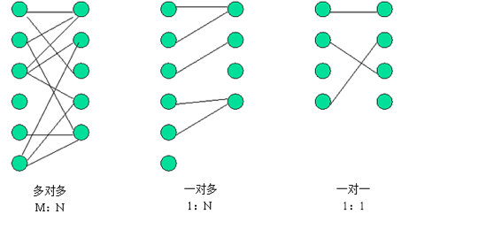
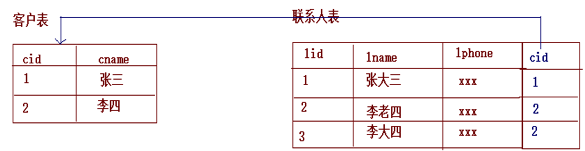
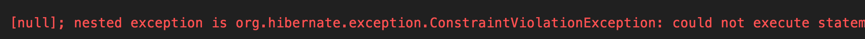
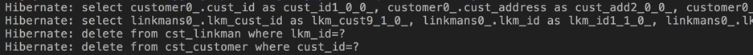
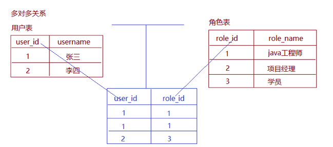
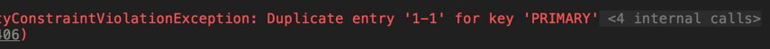

# 				Spring Data JPA第三天

回顾：

1、Spring Data JPA（Hibernate）和JPA的关系

2、搭建Spring Data JPA的环境

​	编写配置文件

​	编写dao接口

3、Spring Data JPA提供都几种查询方法

4、Specifications动态查询

# 1.Specifications动态查询

有时我们在查询某个实体的时候，给定的条件是不固定的，这时就需要动态构建相应的查询语句，在Spring Data JPA中可以通过JpaSpecificationExecutor接口查询。相比JPQL,其优势是类型安全,更加的面向对象。 

```java
import java.util.List;

import org.springframework.data.domain.Page;
import org.springframework.data.domain.Pageable;
import org.springframework.data.domain.Sort;
import org.springframework.data.jpa.domain.Specification;

/**
 *	JpaSpecificationExecutor中定义的方法
 **/
 public interface JpaSpecificationExecutor<T> {
   	//根据条件查询一个对象
 	T findOne(Specification<T> spec);	
   	//根据条件查询集合
 	List<T> findAll(Specification<T> spec);
   	//根据条件分页查询
 	Page<T> findAll(Specification<T> spec, Pageable pageable);
   	//排序查询查询
 	List<T> findAll(Specification<T> spec, Sort sort);
   	//统计查询
 	long count(Specification<T> spec);
}
```

对于JpaSpecificationExecutor，这个接口基本是围绕着Specification接口来定义的。我们可以简单的理解为，Specification构造的就是查询条件。 

Specification接口中只定义了如下一个方法： 

```java
 //构造查询条件
    /**
    *	root	：Root接口，代表查询的根对象，可以通过root获取实体中的属性
    *	query	：代表一个顶层查询对象，用来自定义查询
    *	cb		：用来构建查询，此对象里有很多条件方法
    **/
    public Predicate toPredicate(Root<T> root, CriteriaQuery<?> query, CriteriaBuilder cb);
```

## 1.1.使用Specifications完成单个条件查询

```java
@RunWith(SpringJUnit4ClassRunner.class)
@ContextConfiguration("classpath:applicationContext.xml")
public class TestSpec {

    @Autowired
    private CustomerDao customerDao;

     /**
     * 单个条件查询，查询单个对象
     */
    @Test
    public void test1() {

        Specification<Customer> spec = new Specification<Customer>() {
            /**
             *
             * @param root 查询的根对象，可以通过root获取实体中的属性
             * @param query 代表一个顶层的查询对象，了解
             * @param cb 用来构建查询条件，此对象里有很多查询条件方法
             * @return
             */
            @Override
            public Predicate toPredicate(Root root, CriteriaQuery query, CriteriaBuilder cb) {
                //获取查询属性
                Path path = root.get("custName");
                //构造查询条件
                Predicate predicate = cb.equal(path, "黑马程序员");
                //返回查询条件
                return predicate;
            }
        };

        Customer customer = customerDao.findOne(spec).orElse(null);
        System.out.println(customer);
    }
}
```

## 1.2.使用Specifications完成多个条件查询

```java
	/**
     * 多条件查询，查询单个对象
     */
    @Test
    public void test2() {

        Specification<Customer> spec = new Specification<Customer>() {

            @Override
            public Predicate toPredicate(Root<Customer> root, CriteriaQuery<?> query, CriteriaBuilder cb) {
                //获取第一个查询属性
                Path<Object> custName = root.get("custName");
                //构造第一个查询条件
                Predicate p1 = cb.equal(custName, "传智播客");

                //获取第二个查询属性
                Path<Object> custIndustry = root.get("custIndustry");
                //构造第二个查询条件
                Predicate p2 = cb.equal(custIndustry, "教育培训");

                //两个条件用and连接
                Predicate p3 = cb.and(p1, p2);
                //返回查询条件
                return p3;
            }
        };

        Customer customer = customerDao.findOne(spec).orElse(null);
        System.out.println(customer);
    }
```

## 1.3.使用Specifications完成模糊查询

```java
 	/**
     * 根据cust_name模糊查询，返回客户列表
     */
    @Test
    public void test3() {
        Specification<Customer> spec = new Specification<Customer>() {
            @Override
            public Predicate toPredicate(Root<Customer> root, CriteriaQuery<?> query, CriteriaBuilder cb) {
                //获取查询属性
                Path<Object> custName = root.get("custName");
                //构造查询条件
                //equal：可以直接得到Path对象进行比较
                //like：得到Path对象，根据Path指定比较的参数类型，再进行比较
                Predicate predicate = cb.like(custName.as(String.class), "%传智%");
                return predicate;
            }
        };

        List<Customer> list = customerDao.findAll(spec);
        for (Customer customer : list) {
            System.out.println(customer);
        }
    }
```

## 1.4.使用Specifications完成排序查询

```java
  	/**
     * 排序查询
     */
    @Test
    public void test4() {
        Specification<Customer> spec = new Specification<Customer>() {
            @Override
            public Predicate toPredicate(Root<Customer> root, CriteriaQuery<?> query, CriteriaBuilder cb) {
                //获取查询属性
                Path<Object> custName = root.get("custName");
                //构造查询条件
                //equal：可以直接得到Path对象进行比较
                //like：得到Path对象，根据Path指定比较的参数类型，再进行比较
                Predicate predicate = cb.like(custName.as(String.class), "%传智%");
                return predicate;
            }
        };
        //指定排序方式和排序属性
        Sort sort = new Sort(Sort.Direction.DESC, "custId");
        List<Customer> list = customerDao.findAll(spec, sort);
        for (Customer customer : list) {
            System.out.println(customer);
        }
    }
```

## 1.5.使用Specifications完成分页查询

```java
	/**
     * 分页查询，不带条件
     */
    @Test
    public void test5() {
        /*
            构造分页参数对象
            Pageable是接口，实现类是PageRequest
            参数1：页码，从0开始计数
            参数2：每页的大小
         */
        Pageable pageable = PageRequest.of(1,5);
        //Page是Spring Data JPA内部给我们封装的一个分页类
        Page<Customer> page = customerDao.findAll(pageable);
        //获取当前页的数据集合
        System.out.println(page.getContent());
        //获取总页数
        System.out.println(page.getTotalPages());
        //获取总记录数
        System.out.println(page.getTotalElements());
    }

    /**
     * 分页查询，带条件
     */
    @Test
    public void test6() {
        //构造查询条件
        Specification<Customer> spec = new Specification<Customer>() {
            @Override
            public Predicate toPredicate(Root<Customer> root, CriteriaQuery<?> query, CriteriaBuilder cb) {
                Path<Object> custName = root.get("custName");
                Predicate predicate = cb.like(custName.as(String.class), "%传智%");
                return predicate;
            }
        };
        //构造分页信息对象
        Pageable pageable = PageRequest.of(0,5);
        //带条件分页查询
        Page<Customer> page = customerDao.findAll(spec, pageable);
        System.out.println(page.getContent());
        System.out.println(page.getTotalElements());
        System.out.println(page.getTotalPages());
    }
```

对于Spring Data JPA中的分页查询，是其内部自动实现的封装过程，返回的是一个Spring Data JPA提供的pageBean对象。其中的方法说明如下： 

```java
 //获取总页数
int getTotalPages();
//获取总记录数	
long getTotalElements();
//获取列表数据
List<T> getContent();
```

## 1.6.方法对应关系

| 方法名称                    | Sql对应关系            |
| --------------------------- | ---------------------- |
| equle                       | filed =   value        |
| gt（greaterThan ）          | filed   > value        |
| lt（lessThan ）             | filed   < value        |
| ge（greaterThanOrEqualTo ） | filed   >= value       |
| le（ lessThanOrEqualTo）    | filed   <= value       |
| notEqule                    | filed   != value       |
| like                        | filed   like value     |
| notLike                     | filed   not like value |

# 2.多表设计

## 2.1.表之间关系的划分

数据库中多表之间存在着三种关系，如图所示。 



从图可以看出，系统设计的三种实体关系分别为：多对多、一对多和一对一关系。注意：一对多关系可以看为两种：  即一对多，多对一。所以说四种更精确。

明确：    我们今天只涉及实际开发中常用的关联关系，一对多和多对多。而一对一的情况，可以看成是一种特殊的一对多，会了一对多，一对一自然就会了。

## 2.2.在JPA框架中表关系的分析步骤

在实际开发中，我们数据库的表难免会有相互的关联关系，在操作表的时候就有可能会涉及到多张表的操作。而在这种实现了ORM思想的框架中（如JPA），可以让我们通过操作实体类就实现对数据库表的操作。所以今天我们的学习重点是：掌握配置实体之间的关联关系。

第一步：首先确定两张表之间的关系。如果关系确定错了，后面做的所有操作就都不可能正确。

第二步：在数据库中实现两张表的关系

第三步：在实体类中描述出两个实体的关系

第四步：配置出实体类和数据库表的关系映射（重点）

# 3.JPA中的一对多

## 3.1.示例分析

我们采用的示例为客户和联系人。

客户：指的是一家公司，我们记为A。

联系人：指的是A公司中的员工。

在不考虑兼职的情况下，公司和员工的关系即为一对多。

## 3.2.表关系建立

在一对多关系中，我们习惯把一的一方称之为主表，把多的一方称之为从表。在数据库中建立一对多的关系，需要使用数据库的外键约束。

 什么是外键？

指的是从表中有一列，取值参照主表的主键，这一列就是外键。

 一对多数据库关系的建立，如下图所示：



## 3.3.实体类关系建立以及映射配置

在实体类中，由于客户是少的一方，它应该包含多个联系人，所以实体类要体现出客户中有多个联系人的信息，代码如下： 

```java
/**
 * 客户的实体类
 * 明确使用的注解都是JPA规范的
 * 所以导包都要导入javax.persistence包下的
 */
@Entity
@Table(name = "cst_customer")
public class Customer implements Serializable{
    @Id
    @GeneratedValue(strategy = GenerationType.IDENTITY)
    @Column(name="cust_id")
    private Long custId;
    @Column(name="cust_name")
    private String custName;
    @Column(name="cust_source")
    private String custSource;
    @Column(name="cust_industry")
    private String custIndustry;
    @Column(name="cust_level")
    private String custLevel;
    @Column(name="cust_address")
    private String custAddress;
    @Column(name="cust_phone")
    private String custPhone;

     //配置客户和联系人的一对多关系
    @OneToMany(targetEntity = LinkMan.class)
    @JoinColumn(name="lkm_cust_id",referencedColumnName = "cust_id")
    private Set<LinkMan> linkmans = new HashSet<LinkMan>();


    public Long getCustId() {
        return custId;
    }

    public void setCustId(Long custId) {
        this.custId = custId;
    }

    public String getCustName() {
        return custName;
    }

    public void setCustName(String custName) {
        this.custName = custName;
    }

    public String getCustSource() {
        return custSource;
    }

    public void setCustSource(String custSource) {
        this.custSource = custSource;
    }

    public String getCustIndustry() {
        return custIndustry;
    }

    public void setCustIndustry(String custIndustry) {
        this.custIndustry = custIndustry;
    }

    public String getCustLevel() {
        return custLevel;
    }

    public void setCustLevel(String custLevel) {
        this.custLevel = custLevel;
    }

    public String getCustAddress() {
        return custAddress;
    }

    public void setCustAddress(String custAddress) {
        this.custAddress = custAddress;
    }

    public String getCustPhone() {
        return custPhone;
    }

    public void setCustPhone(String custPhone) {
        this.custPhone = custPhone;
    }

    public Set<LinkMan> getLinkmans() {
        return linkmans;
    }

    public void setLinkmans(Set<LinkMan> linkmans) {
        this.linkmans = linkmans;
    }

    @Override
    public String toString() {
        return "Customer{" +
                "custId=" + custId +
                ", custName='" + custName + '\'' +
                ", custSource='" + custSource + '\'' +
                ", custIndustry='" + custIndustry + '\'' +
                ", custLevel='" + custLevel + '\'' +
                ", custAddress='" + custAddress + '\'' +
                ", custPhone='" + custPhone + '\'' +
                '}';
    }
}
```

由于联系人是多的一方，在实体类中要体现出，每个联系人只能对应一个客户，代码如下： 

```java
@Entity
@Table(name="cst_linkman")
public class LinkMan implements Serializable{

    @Id
    @GeneratedValue(strategy = GenerationType.IDENTITY)
    @Column(name="lkm_id")
    private Long lkmId;
    @Column(name="lkm_name")
    private String lkmName;
    @Column(name="lkm_gender")
    private String lkmGender;
    @Column(name="lkm_phone")
    private String lkmPhone;
    @Column(name="lkm_mobile")
    private String lkmMobile;
    @Column(name="lkm_email")
    private String lkmEmail;
    @Column(name="lkm_position")
    private String lkmPosition;
    @Column(name="lkm_memo")
    private String lkmMemo;

    @ManyToOne(targetEntity = Customer.class)
    @JoinColumn(name="lkm_cust_id",referencedColumnName = "cust_id")
    private Customer customer;

    public Long getLkmId() {
        return lkmId;
    }

    public void setLkmId(Long lkmId) {
        this.lkmId = lkmId;
    }

    public String getLkmName() {
        return lkmName;
    }

    public void setLkmName(String lkmName) {
        this.lkmName = lkmName;
    }

    public String getLkmGender() {
        return lkmGender;
    }

    public void setLkmGender(String lkmGender) {
        this.lkmGender = lkmGender;
    }

    public String getLkmPhone() {
        return lkmPhone;
    }

    public void setLkmPhone(String lkmPhone) {
        this.lkmPhone = lkmPhone;
    }

    public String getLkmMobile() {
        return lkmMobile;
    }

    public void setLkmMobile(String lkmMobile) {
        this.lkmMobile = lkmMobile;
    }

    public String getLkmEmail() {
        return lkmEmail;
    }

    public void setLkmEmail(String lkmEmail) {
        this.lkmEmail = lkmEmail;
    }

    public String getLkmPosition() {
        return lkmPosition;
    }

    public void setLkmPosition(String lkmPosition) {
        this.lkmPosition = lkmPosition;
    }

    public String getLkmMemo() {
        return lkmMemo;
    }

    public void setLkmMemo(String lkmMemo) {
        this.lkmMemo = lkmMemo;
    }

    public Customer getCustomer() {
        return customer;
    }

    public void setCustomer(Customer customer) {
        this.customer = customer;
    }

    @Override
    public String toString() {
        return "LinkMan{" +
                "lkmId=" + lkmId +
                ", lkmName='" + lkmName + '\'' +
                ", lkmGender='" + lkmGender + '\'' +
                ", lkmPhone='" + lkmPhone + '\'' +
                ", lkmMobile='" + lkmMobile + '\'' +
                ", lkmEmail='" + lkmEmail + '\'' +
                ", lkmPosition='" + lkmPosition + '\'' +
                ", lkmMemo='" + lkmMemo + '\'' +
                '}';
    }
}
```

测试发现，表能创建出来，但是控制台没有显示建表语句，可以在applicationContext.xml中加如下配置：

```xml

    <!--把EntityManagerFactory交给spring管理-->
    <bean id="entityManagerFactory" class="org.springframework.orm.jpa.LocalContainerEntityManagerFactoryBean">
        <property name="dataSource" ref="dataSource"/>
        <!--扫描实体类-->
        <property name="packagesToScan" value="cn.itcast.domain"/>
        <!--指定JPA规范的提供商-->
        <property name="persistenceProvider">
            <bean class="org.hibernate.jpa.HibernatePersistenceProvider"/>
        </property>

        <!--配置jpa供应商的适配器-->
        <property name="jpaVendorAdapter">
            <bean class="org.springframework.orm.jpa.vendor.HibernateJpaVendorAdapter">
                <!--指定在没有表的情况下，要自动创建表-->
                <property name="generateDdl" value="true"/>
                <!--指定数据库类型-->
                <property name="database" value="MYSQL"/>
                <!--指定数据库的方言-->
                <property name="databasePlatform" value="org.hibernate.dialect.MySQLDialect"/>
                <property name="showSql" value="true"/>
            </bean>
        </property>

        <!--配置JPA方言-->
        <property name="jpaDialect">
            <bean class="org.springframework.orm.jpa.vendor.HibernateJpaDialect"/>
        </property>

        <property name="jpaProperties">
            <props>
                <prop key="hibernate.format_sql">true</prop>
                <prop key="hibernate.hbm2ddl.auto">update</prop>
            </props>
        </property>
    </bean>

```


## 3.4.映射的注解说明

**@OneToMany:**

      作用：建立一对多的关系映射
    
    属性：
    
               targetEntityClass：指定多的多方的类的字节码
    
               mappedBy：指定从表实体类中引用主表对象的名称。
    
               cascade：指定要使用的级联操作
    
               fetch：指定是否采用延迟加载
    
               orphanRemoval：是否使用孤儿删除

 **@ManyToOne**

    作用：建立多对一的关系
    
    属性：
    
               targetEntityClass：指定一的一方实体类字节码
    
               cascade：指定要使用的级联操作
    
               fetch：指定是否采用延迟加载
    
               optional：关联是否可选。如果设置为false，则必须始终存在非空关系。

**@JoinColumn**

     作用：用于定义主键字段和外键字段的对应关系。
    
     属性：
    
               name：指定外键字段的名称
    
               referencedColumnName：指定引用主表的主键字段名称
    
               unique：是否唯一。默认值不唯一
    
               nullable：是否允许为空。默认值允许。
    
               insertable：是否允许插入。默认值允许。
    
               updatable：是否允许更新。默认值允许。
    
               columnDefinition：列的定义信息。

## 3.5.一对多的操作

### 3.5.1.添加

```java
@RunWith(SpringJUnit4ClassRunner.class)
@ContextConfiguration("classpath:applicationContext.xml")
public class TestOneToMany {

    @Autowired
    private CustomerDao customerDao;

    @Autowired
    private LinkManDao linkManDao;
    /**
     * 一对多保存
     */
    @Test
    @Transactional
    @Rollback(false)
    public void test1() {
        Customer customer = new Customer();
        customer.setCustName("百度");

        LinkMan linkMan = new LinkMan();
        linkMan.setLkmName("小李");

        customer.getLinkmans().add(linkMan);
        linkMan.setCustomer(customer);

        customerDao.save(customer);
        linkManDao.save(linkMan);
    }
}
```

通过保存的案例，我们可以发现在设置了双向关系之后，会发送两条insert语句，一条多余的update语句，那我们的解决是思路很简单，就是一的一方放弃维护权，也只能让一的一方放弃外键维护权。修改Customer类如下： 

```java
/**
	 *放弃外键维护权的配置将如下配置改为
	 */
    //@OneToMany(targetEntity=LinkMan.class)
//@JoinColumn(name="lkm_cust_id",referencedColumnName="cust_id")	
//设置为
	@OneToMany(targetEntity=LinkMan.class,mappedBy="customer")
```

mappedBy表示放弃外键维护权，由对方来维护，此时对方是LinkMan,mappedBy的值取的是对方（LinkMan）中与自己（Customer）关联的属性名。 

### 3.5.2.删除

```java
  	@Test
    public void test2() {
        customerDao.deleteById(1L);
    }
```

如果在Customer中配置了放弃了外键维护权，那么，此处会报错，提示违反外键约束： 



删除操作的说明如下：

 删除从表数据：可以随时任意删除。

 删除主表数据：

- 没有从表数据引用：随便删

- 有从表数据

  1、在默认情况下，它会把外键字段置为null，然后删除主表数据。如果在数据库的表结构上，外键字段有非空约束，默认情况就会报错了。

  2、如果配置了放弃维护关联关系的权利，则不能删除（与外键字段是否允许为null，没有关系）因为在删除时，它根本不会去更新从表的外键字段了。

  3、如果还想删除，需要使用级联删除


### 3.5.3.级联操作

级联操作：指操作一个对象同时操作它的关联对象

使用方法：只需要在操作主体的注解上配置cascade

```java
	/**
	 * cascade:配置级联操作
	 * 		CascadeType.MERGE	级联更新
	 * 		CascadeType.PERSIST	级联保存：
	 * 		CascadeType.REFRESH 级联刷新：
	 * 		CascadeType.REMOVE	级联删除：
	 * 		CascadeType.ALL		包含所有
	 */
	@OneToMany(mappedBy="customer",cascade=CascadeType.ALL)

```

#### 3.5.3.1.在Customer类配置级联删除

```java
 @OneToMany(targetEntity = LinkMan.class,mappedBy = "customer",cascade = CascadeType.REMOVE)
 private Set<LinkMan> linkmans = new HashSet<LinkMan>();
```

再次测试删除cust_id为1的客户，结果如下： 



#### 3.5.3.2.在LinkMan类中配置级联删除

```java
@ManyToOne(targetEntity = Customer.class,cascade = CascadeType.REMOVE)
@JoinColumn(name="lkm_cust_id",referencedColumnName = "cust_id")
private Customer customer;
```

删除联系人，级联删除客户，一般不这么用。 

# 4.JPA中的多对多

## 4.1.示例分析

我们采用的示例为用户和角色。

用户：指的是咱们班的每一个同学。

角色：指的是咱们班同学的身份信息。

比如A同学，它是我的学生，其中有个身份就是学生，还是家里的孩子，那么他还有个身份是子女。

同时B同学，它也具有学生和子女的身份。

那么任何一个同学都可能具有多个身份。同时学生这个身份可以被多个同学所具有。

所以我们说，用户和角色之间的关系是多对多。

## 4.2.表关系建立

多对多的表关系建立靠的是中间表，其中用户表和中间表的关系是一对多，角色表和中间表的关系也是一对多，如下图所示： 



## 4.3.实体类关系建立以及映射配置

一个用户可以具有多个角色，所以在用户实体类中应该包含多个角色的信息，代码如下： 

```java
@Entity
@Table(name = "sys_user")
public class SysUser implements Serializable {
    @Id
    @GeneratedValue(strategy = GenerationType.IDENTITY)
    @Column(name = "user_id")
    private Long userId;
    @Column(name = "user_code")
    private String userCode;
    @Column(name = "user_name")
    private String userName;
    @Column(name = "user_password")
    private String userPassword;
    @Column(name = "user_state")
    private String userState;

    @ManyToMany(targetEntity = SysRole.class)
    @JoinTable(name = "user_role", joinColumns = @JoinColumn(name = "user_id", referencedColumnName = "user_id"), inverseJoinColumns = @JoinColumn(name = "role_id", referencedColumnName = "role_id"))
    private Set<SysRole> roles = new HashSet<SysRole>();

    public Long getUserId() {
        return userId;
    }

    public void setUserId(Long userId) {
        this.userId = userId;
    }

    public String getUserCode() {
        return userCode;
    }

    public void setUserCode(String userCode) {
        this.userCode = userCode;
    }

    public String getUserName() {
        return userName;
    }

    public void setUserName(String userName) {
        this.userName = userName;
    }

    public String getUserPassword() {
        return userPassword;
    }

    public void setUserPassword(String userPassword) {
        this.userPassword = userPassword;
    }

    public String getUserState() {
        return userState;
    }

    public void setUserState(String userState) {
        this.userState = userState;
    }

    public Set<SysRole> getRoles() {
        return roles;
    }

    public void setRoles(Set<SysRole> roles) {
        this.roles = roles;
    }

    @Override
    public String toString() {
        return "SysUser{" +
                "userId=" + userId +
                ", userCode='" + userCode + '\'' +
                ", userName='" + userName + '\'' +
                ", userPassword='" + userPassword + '\'' +
                ", userState='" + userState + '\'' +
                '}';
    }
}
```

一个角色可以赋予多个用户，所以在角色实体类中应该包含多个用户的信息，代码如下： 

```java
@Entity
@Table(name = "sys_role")
public class SysRole implements Serializable {
    @Id
    @GeneratedValue(strategy = GenerationType.IDENTITY)
    @Column(name = "role_id")
    private Long roleId;
    @Column(name = "role_name")
    private String roleName;
    @Column(name = "role_memo")
    private String roleMemo;

    @ManyToMany(targetEntity = SysUser.class)
    @JoinTable(name = "user_role", joinColumns = @JoinColumn(name = "role_id", referencedColumnName = "role_id"), inverseJoinColumns = @JoinColumn(name = "user_id", referencedColumnName = "user_id"))
    private Set<SysUser> users = new HashSet<SysUser>();

    public Long getRoleId() {
        return roleId;
    }

    public void setRoleId(Long roleId) {
        this.roleId = roleId;
    }

    public String getRoleName() {
        return roleName;
    }

    public void setRoleName(String roleName) {
        this.roleName = roleName;
    }

    public String getRoleMemo() {
        return roleMemo;
    }

    public void setRoleMemo(String roleMemo) {
        this.roleMemo = roleMemo;
    }

    public Set<SysUser> getUsers() {
        return users;
    }

    public void setUsers(Set<SysUser> users) {
        this.users = users;
    }

    @Override
    public String toString() {
        return "SysRole{" +
                "roleId=" + roleId +
                ", roleName='" + roleName + '\'' +
                ", roleMemo='" + roleMemo + '\'' +
                '}';
    }
}

```

## 4.4.映射的注解说明

**@ManyToMany**

           作用：用于映射多对多关系
    
           属性：
    
                     cascade：配置级联操作。
    
                     fetch：配置是否采用延迟加载。
    
               targetEntity：配置目标的实体类。映射多对多的时候不用写。

**@JoinTable**

    作用：针对中间表的配置
    
    属性：
    
               nam：配置中间表的名称
    
               joinColumns：中间表的外键字段关联当前实体类所对应表的主键字段                                                           
    
               inverseJoinColumn：中间表的外键字段关联对方表的主键字段

**@JoinColumn**

    作用：用于定义主键字段和外键字段的对应关系。
    
    属性：
    
               name：指定外键字段的名称
    
               referencedColumnName：指定引用主表的主键字段名称
    
               unique：是否唯一。默认值不唯一
    
               nullable：是否允许为空。默认值允许。
    
               insertable：是否允许插入。默认值允许。
    
               updatable：是否允许更新。默认值允许。
    
               columnDefinition：列的定义信息。

## 4.5.多对多的操作

### 4.5.1.添加

```java
@RunWith(SpringJUnit4ClassRunner.class)
@ContextConfiguration("classpath:applicationContext.xml")
public class TestManyToMany {

    @Autowired
    private SysUserDao sysUserDao;

    @Autowired
    private SysRoleDao sysRoleDao;

    /**
     * 多对多保存
     */
    @Test
    @Transactional
    @Rollback(false)
    public void test1() {
        SysUser user1 = new SysUser();
        user1.setUserName("用户1");

        SysUser user2 = new SysUser();
        user2.setUserName("用户2");

        SysRole role1 = new SysRole();
        role1.setRoleName("角色1");

        SysRole role2 = new SysRole();
        role2.setRoleName("角色2");

        SysRole role3 = new SysRole();
        role3.setRoleName("角色3");

        user1.getRoles().add(role1);
        user1.getRoles().add(role2);

        user2.getRoles().add(role2);
        user2.getRoles().add(role3);

        role1.getUsers().add(user1);
        role2.getUsers().add(user1);
        role2.getUsers().add(user2);
        role3.getUsers().add(user2);

        sysUserDao.save(user1);
        sysUserDao.save(user2);

        sysRoleDao.save(role1);
        sysRoleDao.save(role2);
        sysRoleDao.save(role3);

    }
}
```

测试会报错，提示中间表联合主键冲突： 



原因：

在多对多（保存）中，如果双向都设置关系，意味着双方都维护中间表，都会往中间表插入数据，中间表的2个字段又作为联合主键，所以报错，主键重复，解决保存失败的问题：只需要在任意一方放弃对中间表的维护权即可，推荐在被动的一方放弃，配置如下：

修改SysRole类，放弃外键维护权：

```java
//放弃对中间表的维护权，解决保存中主键冲突的问题
@ManyToMany(targetEntity = SysUser.class,mappedBy = "roles")
private Set<SysUser> users = new HashSet<SysUser>();
```

### 4.5.2.删除

```java
	/**
	 * 删除操作
	 * 	在多对多的删除时，双向级联删除根本不能配置
	 * 禁用
	 *	如果配了的话，如果数据之间有相互引用关系，可能会清空所有数据
	 */
	@Test
	public void testDelete() {
		userDao.deleteById(1l);
	}

```

# 5.Spring Data JPA中的多表查询

## 5.1.对象导航查询

对象图导航检索方式是根据已经加载的对象，导航到他的关联对象。它利用类与类之间的关系来检索对象。例如：我们通过ID查询方式查出一个客户，可以调用Customer类中的getLinkMans()方法来获取该客户的所有联系人。对象导航查询的使用要求是：两个对象之间必须存在关联关系。

查询一个客户，获取该客户下的所有联系人

```java
	@Test
	//由于是在java代码中测试，为了解决no session问题，将操作配置到同一个事务中
	@Transactional 
	public void testFind() {
		Customer customer = customerDao.findById(5l);
		Set<LinkMan> linkMans = customer.getLinkMans();//对象导航查询
		for(LinkMan linkMan : linkMans) {
  			System.out.println(linkMan);
		}
	}
```

查询一个联系人，获取该联系人的所有客户 

```java
	@Test
	public void testFind() {
		LinkMan linkMan = linkManDao.findById(4l);
		Customer customer = linkMan.getCustomer(); //对象导航查询
		System.out.println(customer);
	}

```

对象导航查询的问题分析

问题：我们查询客户时，要不要把联系人查询出来？

 分析：如果我们不查的话，在用的时候还要自己写代码，调用方法去查询。如果我们查出来的，不使用时又会白白的浪费了服务器内存。

 解决：采用延迟加载的思想。通过配置的方式来设定当我们在需要使用时，发起真正的查询。在一对多中，默认就是延迟加载

 配置方式：

```java
	/**
	 * 在客户对象的@OneToMany注解中添加fetch属性
	 * 		FetchType.EAGER	：立即加载
	 * 		FetchType.LAZY	：延迟加载
	 */
	@OneToMany(mappedBy="customer",fetch=FetchType.EAGER)
	private Set<LinkMan> linkMans = new HashSet<>();

```

问题：我们查询联系人时，要不要把客户查询出来？

 分析：例如：查询联系人详情时，肯定会看看该联系人的所属客户。如果我们不查的话，在用的时候还要自己写代码，调用方法去查询。如果我们查出来的话，一个对象不会消耗太多的内存。而且多数情况下我们都是要使用的。

 解决： 采用立即加载的思想。通过配置的方式来设定，只要查询从表实体，就把主表实体对象同时查出来。在多对一种，默认就是立即加载。

 配置方式

```java
/**
	 * 在联系人对象的@ManyToOne注解中添加fetch属性
	 * 		FetchType.EAGER	：立即加载
	 * 		FetchType.LAZY	：延迟加载
	 */
	@ManyToOne(targetEntity=Customer.class,fetch=FetchType.EAGER)
	@JoinColumn(name="cst_lkm_id",referencedColumnName="cust_id")
	private Customer customer;

```

## 5.2.使用Specification查询

```java
 	@Test
    public void test4() {
        Specification<LinkMan> spec = new Specification<LinkMan>() {
            @Override
            public Predicate toPredicate(Root<LinkMan> root, CriteriaQuery<?> query, CriteriaBuilder cb) {
                Join<LinkMan, Customer> join = root.join("customer",JoinType.INNER);
                Predicate predicate = cb.like(join.get("custName").as(String.class), "%百度%");
                return predicate;
            }
        };

        List<LinkMan> list = linkManDao.findAll(spec);
        for (LinkMan linkMan : list) {
            System.out.println(linkMan);
        }
    }
```

