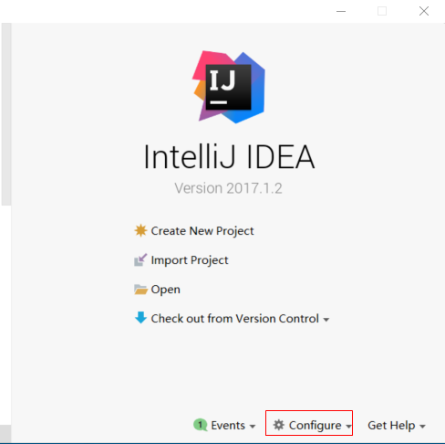
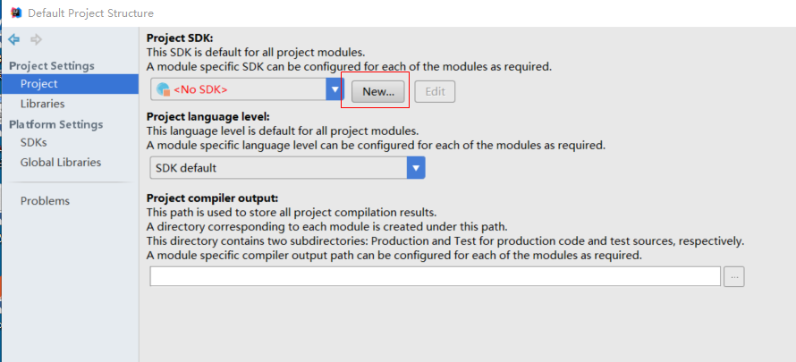
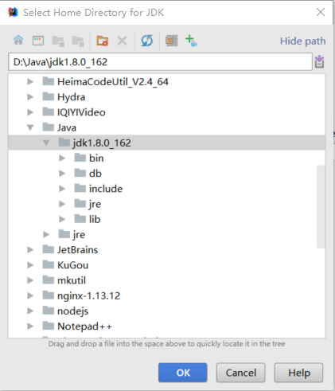
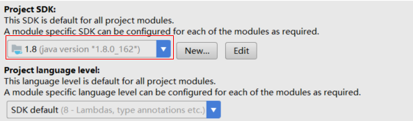
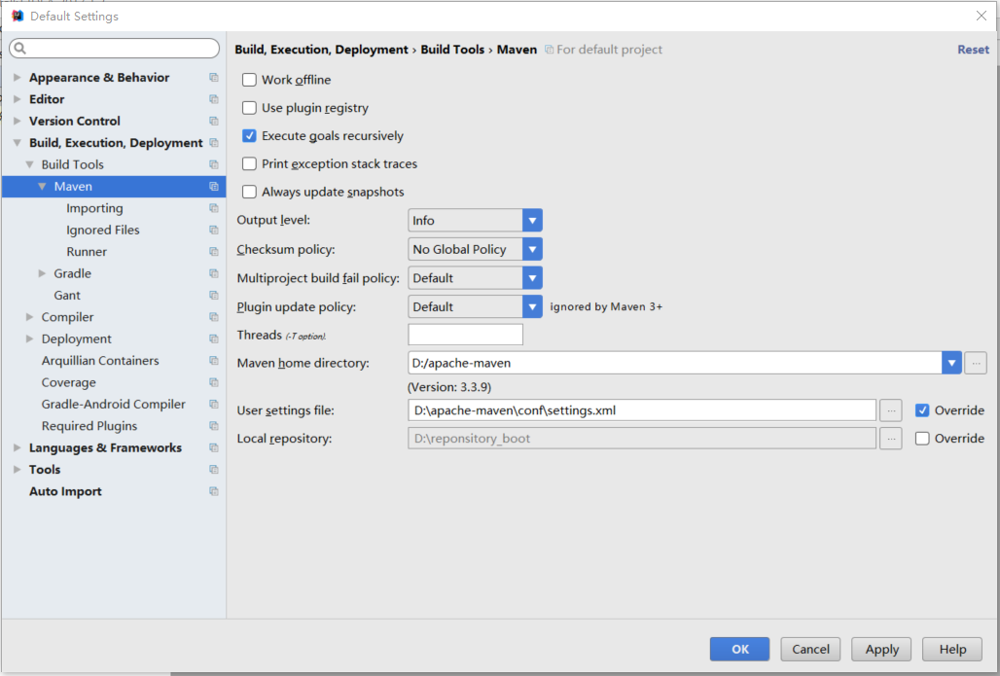

# IDEA配置文档

## 1. 配置JDK

（1）安装JDEA 2017  和 JDK1.8 (步骤略)

（2）启动IDEA ,  第一次启动会弹出如下窗口



（3）点击Configure 下拉菜单选择  Project Defaults  -- Project Structure 



（4）点击new -- jdk  



（5）点击ok



## 2. 配置maven本地仓库

本地仓库配置为课程配套的本地仓库

（1）解压课程提供的本地仓库到某目录（D:\reponsitory_boot）,打开maven的配置文件配置 conf/settings.xml  配置本地仓库

```xml
<localRepository>D:\reponsitory_boot</localRepository>
```

（2）在IDEA中配置本地仓库（全局配置）

File -  Other Settings - Default Settings   ,在弹出窗口中点击左侧菜单如下图所示，设置MavenHome Directory 和User settings file 




