# 第10章-容器管理与弹性扩容  

学习目标：


# 1 容器管理工具Rancher

## 1.1 什么是Rancher

​     Rancher是一个开源的企业级全栈化容器部署及管理平台。Rancher为容器提供一揽子基础架构服务：CNI兼容的网络服务、存储服务、主机管理、负载均衡、防护墙……Rancher让上述服务跨越公有云、私有云、虚拟机、物理机环境运行，真正实现一键式应用部署和管理。

​      https://www.cnrancher.com/

## 1.2 Rancher安装


（1）下载Rancher 镜像

```
docker pull rancher/server
```

（2）创建Rancher容器

```
docker run -d --name=rancher --restart=always -p 9090:8080 rancher/server
```

restart为重启策略

- no，默认策略，在容器退出时不重启容器
- on-failure，在容器非正常退出时（退出状态非0），才会重启容器
  - on-failure:3，在容器非正常退出时重启容器，最多重启3次
- always，在容器退出时总是重启容器
- unless-stopped，在容器退出时总是重启容器，但是不考虑在Docker守护进程启动时就已经停止了的容器

（3）在浏览器输入地址： http://192.168.184.136:9090  即可看到高端大气的欢迎页


点击Got It  进入主界面

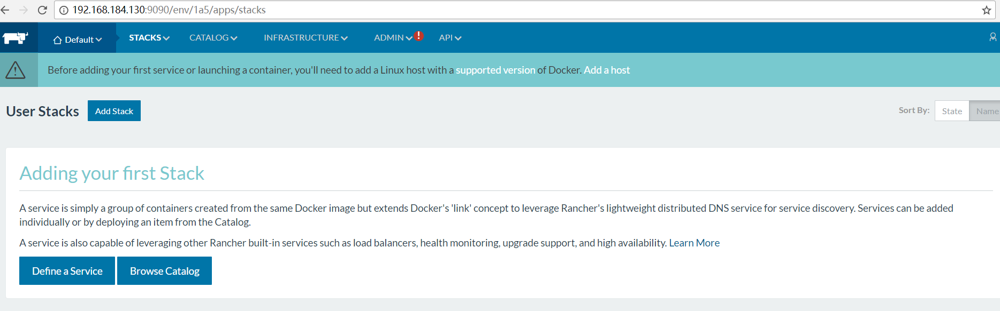

（4）切换至中文界面

点击右下角的English 在弹出菜单中选择中文

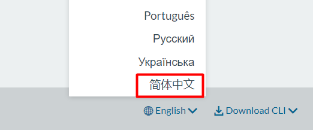

切换后我们就可以看到亲切的中文界面啦~  

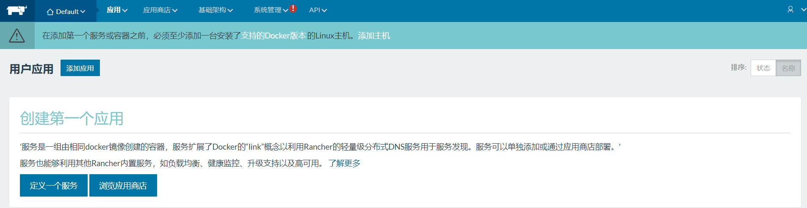


## 1.3 Rancher初始化

### 1.3.1 配置私有仓库

（1）修改daemon.json

```
vi /etc/docker/daemon.json
```

添加以下内容，保存退出。

```json
{"insecure-registries":["192.168.184.135:5000"]} 
```

此步用于让 docker信任私有仓库地址

（3）重启docker 服务

```
systemctl restart docker
```


### 1.3.2  添加环境

Rancher 支持将资源分组归属到多个**环境**。 每个环境具有自己独立的基础架构资源及服务，并由一个或多个用户、团队或组织所管理。

例如，您可以创建独立的“开发”、“测试”及“生产”环境以确保环境之间的安全隔离，将“开发”环境的访问权限赋予全部人员，但限制“生产”环境的访问权限给一个小的团队。

（1）选择“Default -->环境管理” 菜单


（2）填写名称，点击“创建”按钮

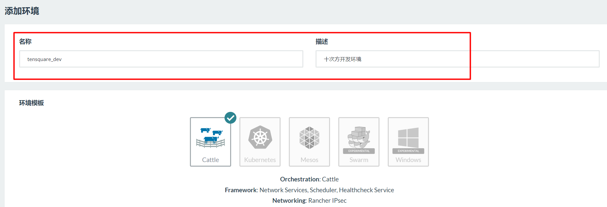

（3）按照上述步骤，添加十次方测试环境和生产环境

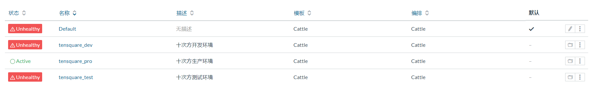

（4）你可以通过点击logo右侧的菜单在各种环境下切换

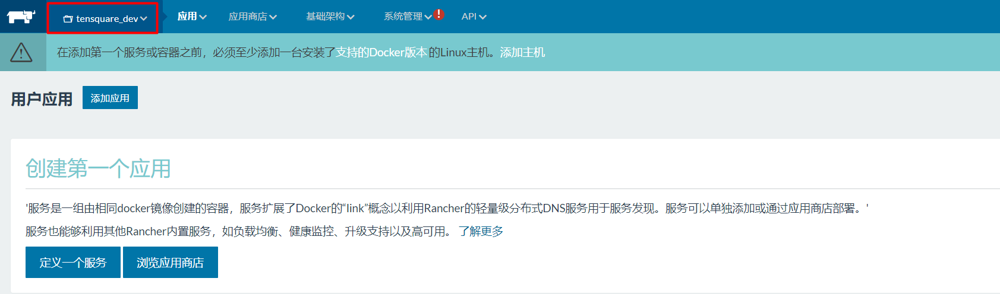


### 1.3.3 添加主机

（1）选择基础架构-->主机 菜单，点击添加主机

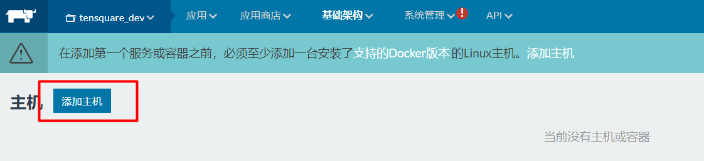

（2）拷贝脚本

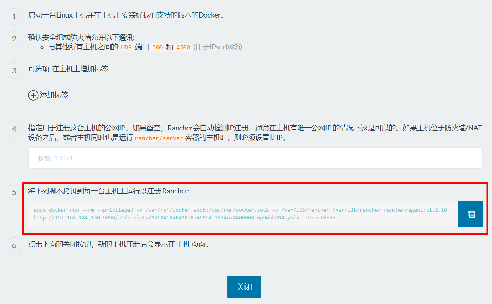

（3）在服务器（虚拟机）上运行脚本

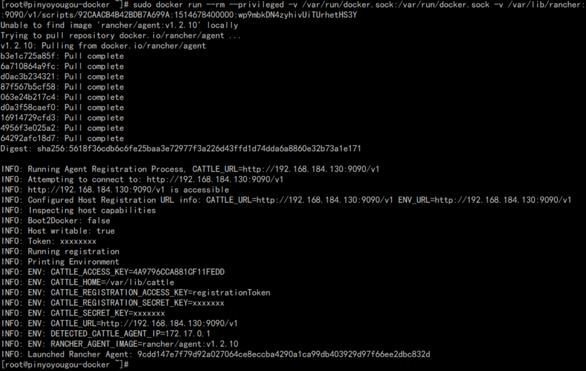

（4）点击关闭按钮后，会看到界面中显示此主机。我们可以很方便地管理主机的每个容器的开启和关闭

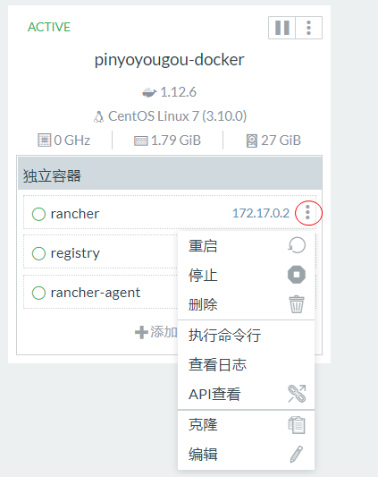

### 1.3.4 添加应用

点击应用-->全部(或用户)  ，点击“添加应用”按钮

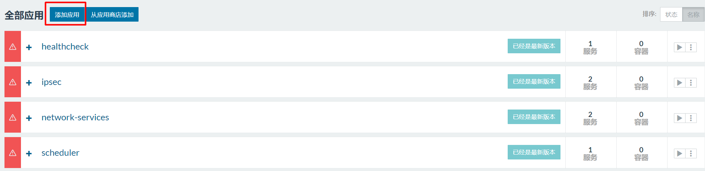

填写名称和描述

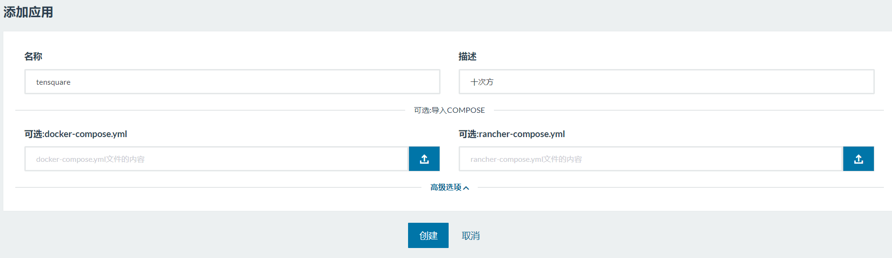

点击“创建”按钮，列表中增加了新增的应用

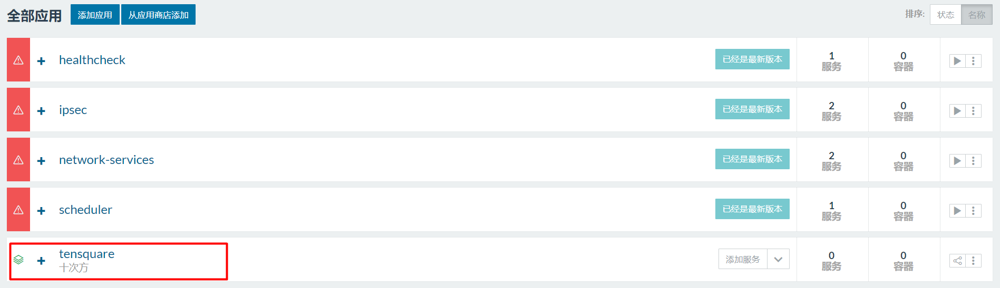

# 2 数据库环境搭建

## 2.1 Redis容器化部署

进入应用，点击添加服务    名称redis ，镜像redis ，端口映射6379 

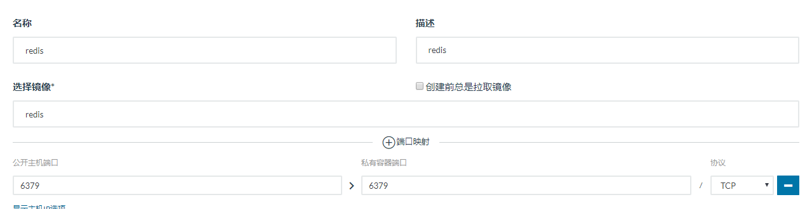

创建后使用客户端测试链接

```
redis-cli -h 192.168.184.136
```

测试成功

## 2.2 MySQL容器部署

镜像：centos/mysql-57-centos7   增加数据库服务

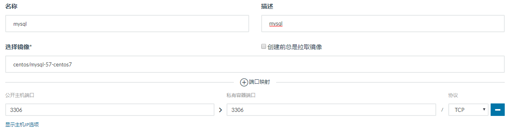

注意：添加环境变量  MYSQL_ROOT_PASSWORD=123456 


点击创建按钮，完成创建    上述操作相当于以下docker命令

```
docker run -di --name mysql -p 3306:3306 -e MYSQL_ROOT_PASSWORD=123456 centos/mysql-57-centos7
```


完成后服务列表中存在并且状态为激活    使用SQLyog测试链接，执行建表语句

## 2.3 MongoDB容器化部署

名称mongo  镜像mongo    端口映射27017 

## 2.4 ElasticSearch容器化部署

名称elasticsearch   镜像elasticsearch:5.6.8  端口映射9300   9200

添加后，浏览器测试： http://192.168.184.136:9200/

## 2.5 RabbitMQ容器化部署

镜像：rabbitmq:management     端口映射5671   5672  4369    15671  15672  25672

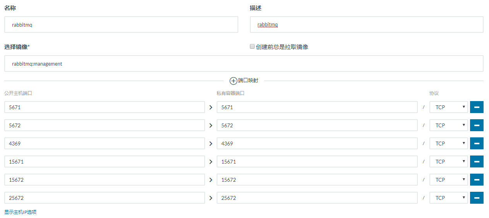

浏览器访问   http://192.168.184.136:15672/

# 3 微服务容器化部署

## 3.1 eureka部署

（1）在用户应用界面中点击“添加服务”  

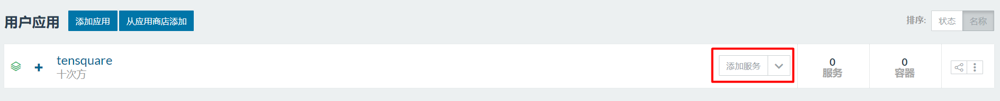

（2）填写名称、描述、镜像和端口映射，点击创建按钮

名称eureka  镜像  192.168.184.135:5000/tensquare_eureka:1.0-SNAPSHOT 

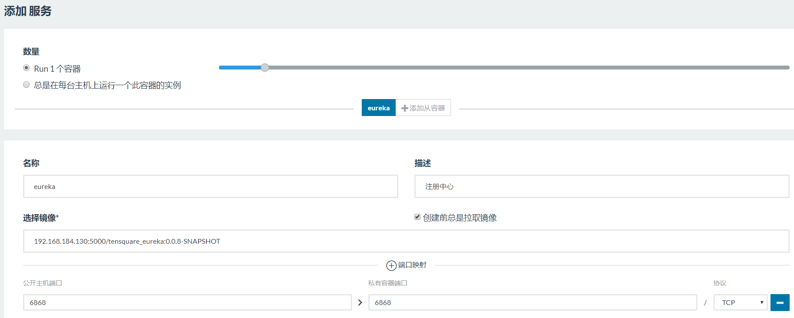

（3）服务添加成功

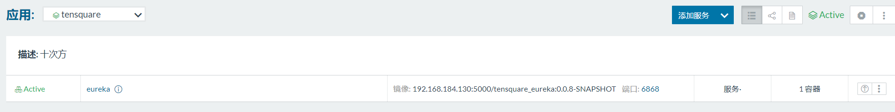

（4）我们现在访问以下我们的系统

http://192.168.184.136:6868/  可以正常访问

## 3.2 配置中心部署

创建容器

添加服务config  镜像  192.168.184.135:5000/tensquare_config:1.0-SNAPSHOT  

映射端口：12000

测试 浏览器输入 http://192.168.184.135:12000/base-dev.yml  可以查看到配置文件内容

## 3.3 十次方公共模块安装

配置的maven命令是

```
clean install
```

## 3.4 基础信息微服务部署

（1）将基础信息微服务上传至Docker私服

（2）添加服务base-service   镜像tensquare_base:1.0-SNAPSHOT    端口映射9100

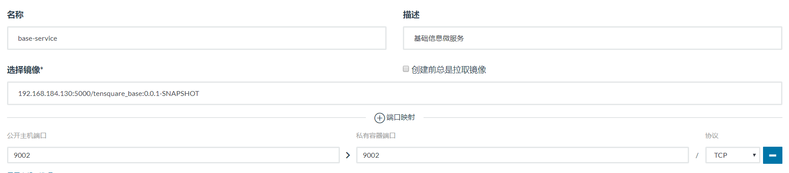

（3）测试微服务  浏览器打开网址  http://192.168.184.136:9001/label   看是否可以看到标签列表

## 3.5其它微服务部署

学员实现


## 3.6 小节

（1）eureka部署

（2）配置中心部署

（3）准备配置文件（对应的环境）上传到码云

（4）修改本地的微服务代码，连接配置中心 

（5）上传代码到git

（6）在Jenkins系统中新建任务，完成持续集成，上传到私有仓库

（7）在Rancher中创建服务，指定私有仓库中的镜像名称，自动下载并创建容器（服务）


软件：

（1）码云 。作用是存储我们的配置文件。

（2）Gogs。与git配合管理我们的源码

（3）Jenkins。实现持续集成。从Git中获取源码，打包编译上传至Docker私有仓库

（4）Rancher。负责从私有仓库或中央仓库中下载镜像自动创建容器。


# 4 弹性扩容解决方案

## 4.1 什么是弹性扩容 


## 4.2 负载均衡器

（1）在Rancher将创建的base-service（基础信息微服务）删除

（2）重新创建base-service ，不设置端口映射

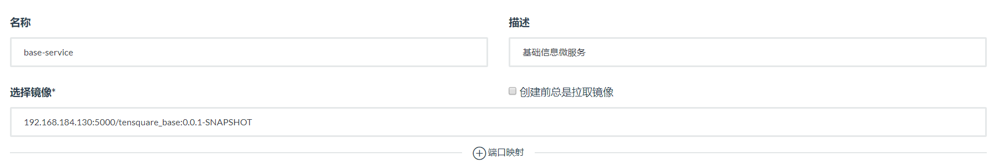

（3）点击“添加服务”按钮右下角 ，弹出菜单选择“添加负载均衡”

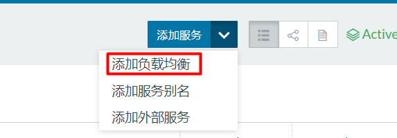

（4）填写负载混衡器名称ha-base-service   端口9001映射为9001，选择目标为base-service工程，点击创建按钮

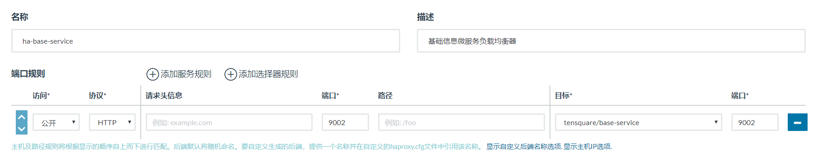

（5）创建后稍等几秒，负载均衡器启动成功

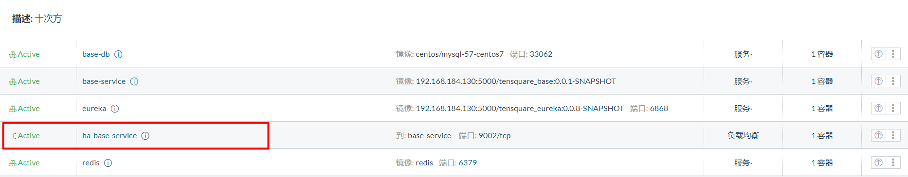

（6）访问测试   浏览器访问：http://192.168.184.130:9002/label 可以看到标签列表

## 4.3 部署WebHooks(钩子)

### 4.3.1 扩容

（1）在选择菜单API  -->WebHooks  ，点击“添加接收器”按钮

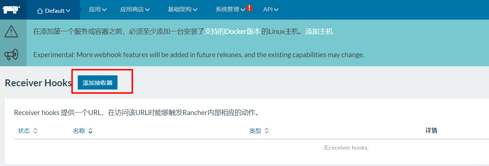

（2）填写名称等信息，选择要扩容的服务，点击创建按钮

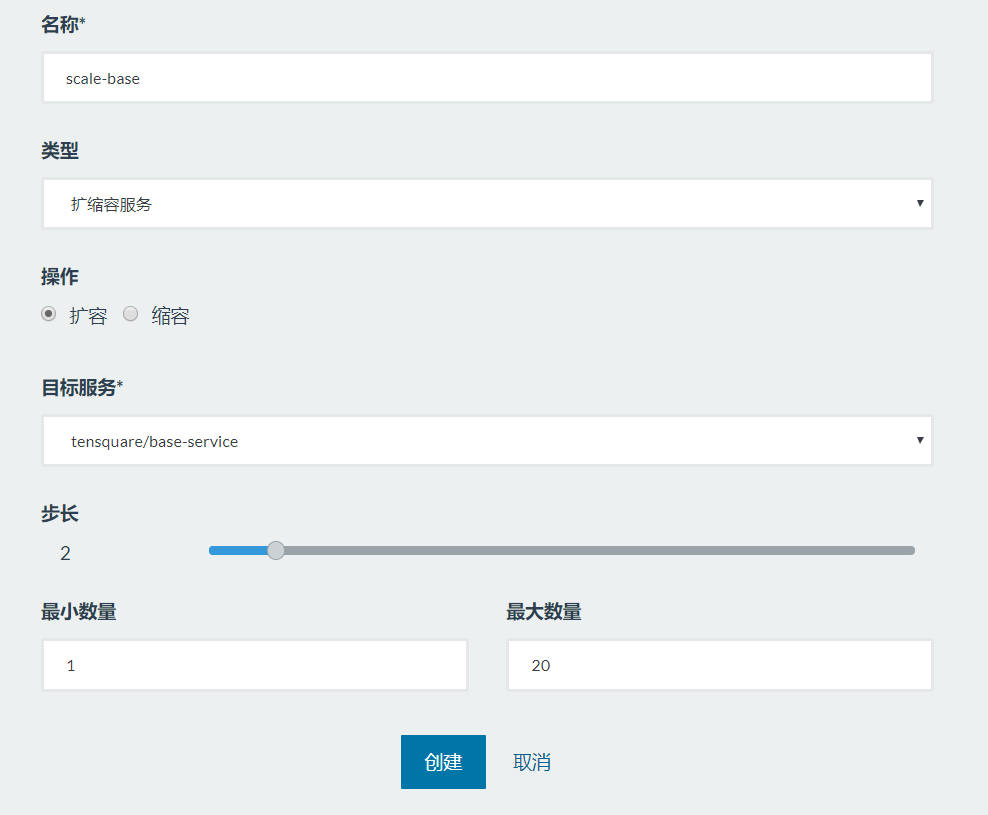

（3）接收器列表中新增了一条记录  ，点击触发地址将地址复制到剪切板

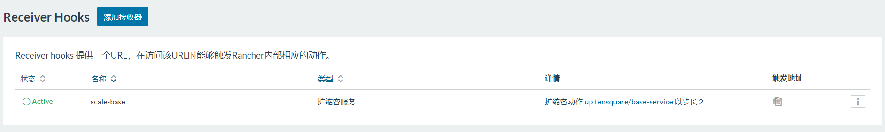

（4）使用postman测试：

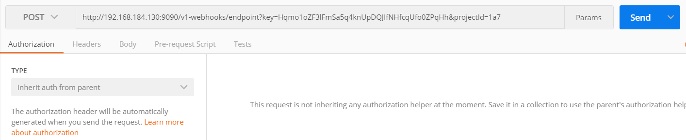

测试后，发现容器由原来的1个变为了3个

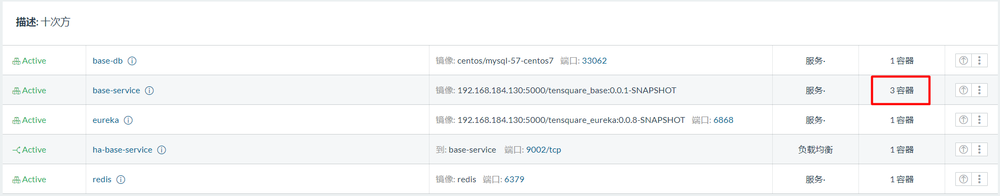

打开erueka，发现服务也有3个

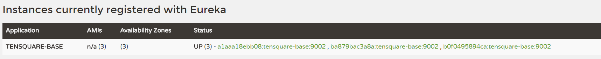

### 4.3.2 缩容

刚才我们实现了扩容，那么如何减少容器数量呢？我们来试试如何缩容

（1）添加接收器  ,选择缩容，步长为1表示每次递减1个 ，点击创建按钮

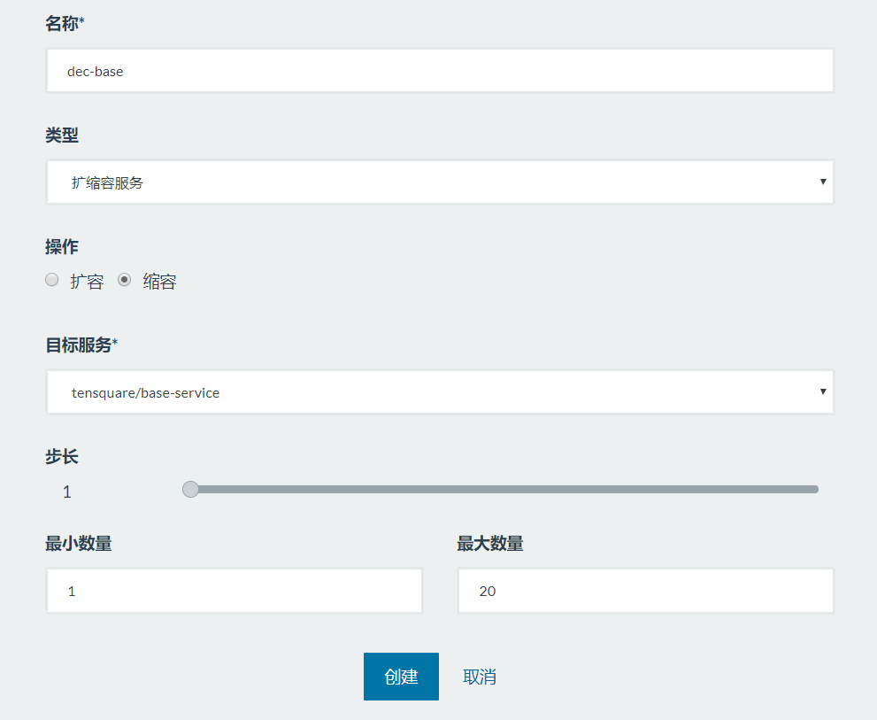

（2）创建成功后，复制触发地址

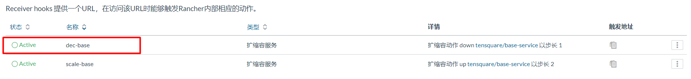

（3）使用postman测试

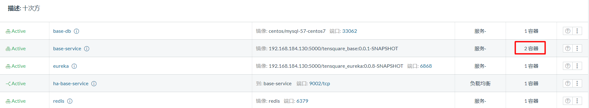


## 4.4 Grafana实现弹性扩容

Grafana是一个可视化面板（Dashboard），有着非常漂亮的图表和布局展示，功能齐全的度量仪表盘和图形编辑器。支持Graphite、zabbix、InfluxDB、Prometheus和OpenTSDB作为数据源。
Grafana主要特性：灵活丰富的图形化选项；可以混合多种风格；支持白天和夜间模式；多个数据源。

### 4.4.1 Grafana应用安装（从应用商店）

（1）选择“应用--全部”  菜单， 点击从应用商店添加按钮


 （2）搜索grafana

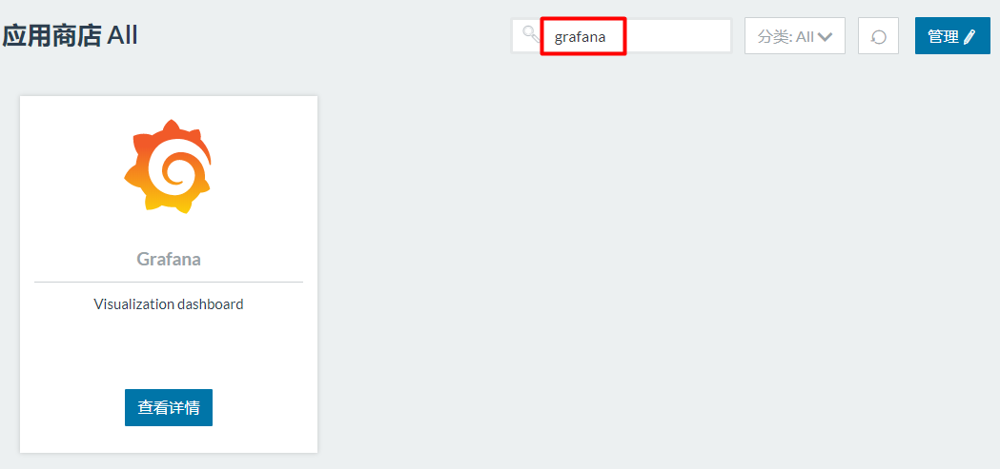

 （3）点击查看详情

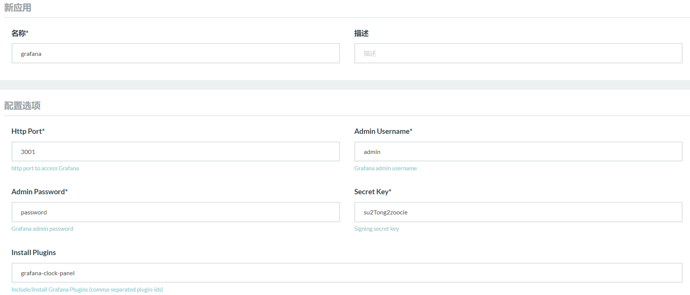

（4）点击启动按钮  ，等待激活

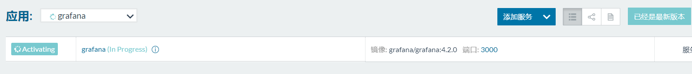

（5）激活后浏览器输入 http://192.168.184.136:3000 进入登录页

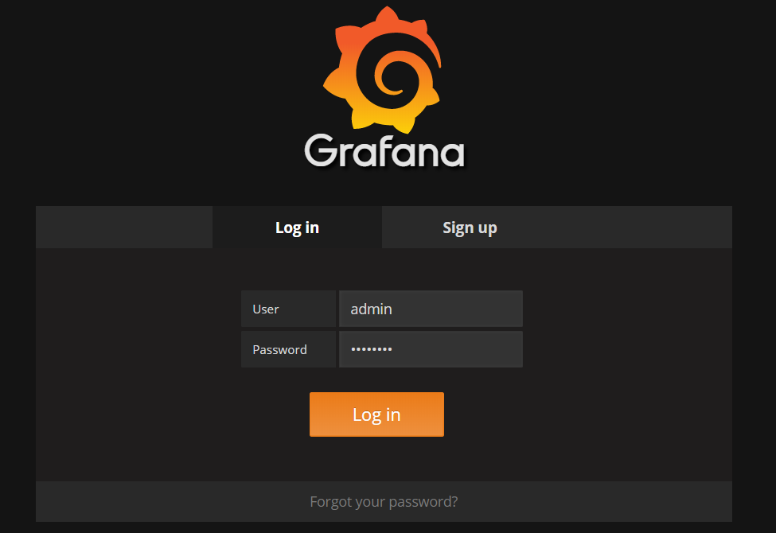

用户名admin  密码password

### 4.4.2 安装（Rpm）

（1）下载及安装

```
wget https://s3-us-west-2.amazonaws.com/grafana-releases/release/grafana-5.1.3-1.x86_64.rpm
sudo yum localinstall grafana-5.1.3-1.x86_64.rpm 
```

（2）启动服务：

```
systemctl start grafana-server
```

端口是3000

### 4.4.3 Alerting（预警）

（1）选择菜单  alerting-->alert List

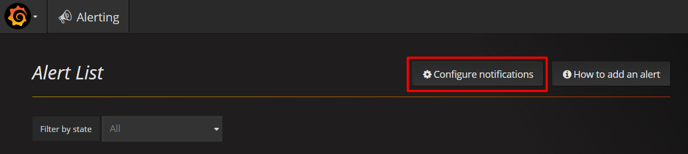

（2）点击Configure notifications按钮  ， 点击new channel ，参照下图填写信息

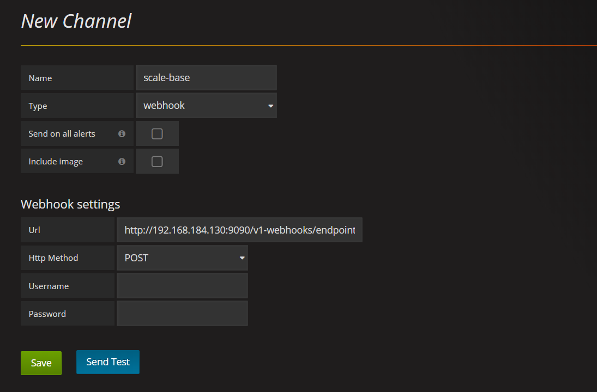

（3）点击SendTest  测试  观察基础微服务是否增加容器

（4）点击save保存

（5）按照同样的方法添加缩容地址

## 4.5 完成其它模块微服务的部署

学员实现  代码略。要求每个模块都有负载均衡器

